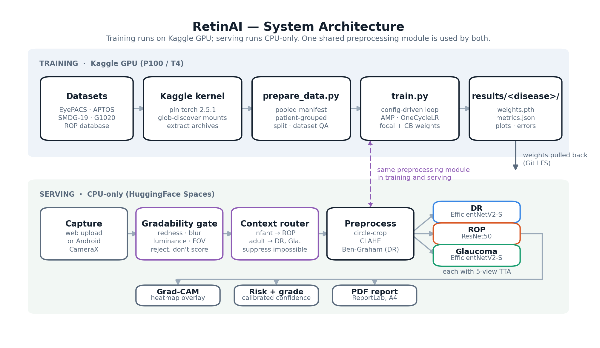
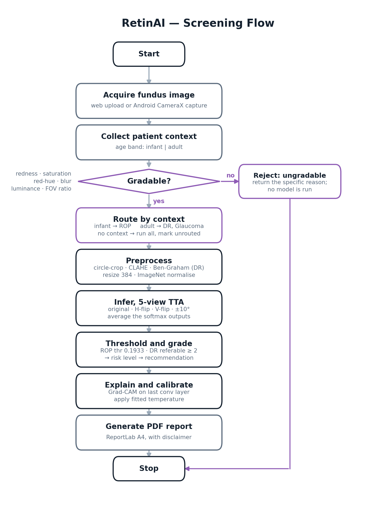
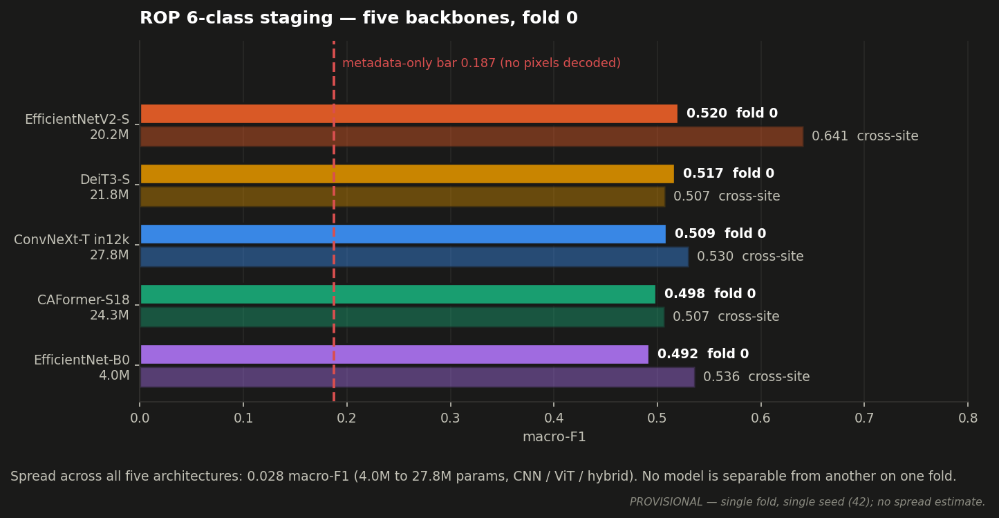

# BE Capstone Project

## Project Title

**RetinAI: Explainable Multi-Disease Retinal Screening from a Single Fundus Photograph**

[](https://www.python.org/)
[](https://pytorch.org/)
[](https://flask.palletsprojects.com/)
[](https://developer.android.com/jetpack/compose)
[](https://champ610-retinal-ai.hf.space)

RetinAI takes one colour fundus (retina) photograph and screens it for three diseases at once:
Diabetic Retinopathy (DR), Retinopathy of Prematurity (ROP) and Glaucoma. Each disease has its
own model with its own tuned operating point. Every result comes back with a Grad-CAM heatmap, a
graded risk level and a downloadable PDF report.

**This is not a medical device.** It is a research and education prototype built for a
final-year capstone project. It has no regulatory clearance and was never prospectively
validated, so it must not be used for real diagnosis. A qualified clinician confirms every
finding.

**Live deployment:** https://champ610-retinal-ai.hf.space
Free tier, CPU only, so expect a few seconds per image. The Android client talks to this same
server.

---

## Table of Contents

1. [Team Details](#team-details)
2. [Guide Details](#guide-details)
3. [Problem Statement](#problem-statement)
4. [Abstract](#abstract)
5. [Objectives](#objectives)
6. [Scope of the Project](#scope-of-the-project)
7. [Existing System](#existing-system)
8. [Proposed System](#proposed-system)
9. [System Architecture](#system-architecture)
10. [Hardware Requirements](#hardware-requirements)
11. [Software Requirements](#software-requirements)
12. [Technologies Used](#technologies-used)
13. [Methodology](#methodology)
14. [Project Timeline](#project-timeline)
15. [Weekly Progress Updates](#weekly-progress-updates)
16. [Design Files](#design-files)
17. [Circuit Diagram](#circuit-diagram)
18. [Flowchart / Algorithm](#flowchart--algorithm)
19. [Implementation Details](#implementation-details)
20. [Code Structure](#code-structure)
21. [How to Run the Project](#how-to-run-the-project)
22. [Testing and Results](#testing-and-results)
23. [Result Images / Videos](#result-images--videos)
24. [Applications](#applications)
25. [Advantages](#advantages)
26. [Limitations](#limitations)
27. [Future Scope](#future-scope)
28. [Research Paper / Publication](#research-paper--publication)
29. [References](#references)
30. [Repository Update Guidelines](#repository-update-guidelines)
31. [Declaration](#declaration)
32. [License](#license)

---

## Team Details

| Sr. No. | Name of Student | Roll No. | Branch | Email ID | GitHub ID |
|---|---|---|---|---|---|
| 1 | Rutuja Bait | 36  | Automation and Robotics | 2023.rutuja.bait@ves.ac.in  | rutujabait |
| 2 | Pravar Rangnekar | 25 | Automation and Robotics | 2023.pravar.rangnekar@ves.ac.in | PravarRangnekar |
| 3 | Yash Shengale | 63 | Automation and Robotics | 2023.yash.shengale@ves.ac.in | yashshengale |
| 4 | Praharsh Nagpure | 16 | Automation and Robotics | 2023.praharsh.nagpure@ves.ac.in | Coldbari |

---

## Guide Details

**Project Guide:** Mrs. Amudha Kumar
**Department:** Automation and Robotics
**Institute:** Vivekanand Education Society's Institute of Technology (VESIT), Mumbai

---

## Problem Statement

> The aim of this project is to design and develop an explainable deep-learning screening
> assistant that detects Diabetic Retinopathy, Retinopathy of Prematurity and Glaucoma from a
> single colour fundus photograph, so that limited ophthalmologist time can be directed to the
> patients most likely to need it, and to establish through device-controlled and
> source-controlled validation how much of that screening performance is real.

All three diseases share a property that makes them worth screening for: they are irreversible
once symptomatic but treatable if caught early, and all three show up in a photograph of the
retina. They also share an obstacle. Someone trained has to read that photograph, and there are
not enough people who can.

India has roughly one ophthalmologist per 100,000 people, and most of them are in cities.
Diabetic Retinopathy needs annual screening of every diabetic patient. Retinopathy of
Prematurity needs repeated bedside examination of every pre-term infant in a NICU, inside a
narrow window where treatment still works. The camera is not the bottleneck. The reading is.

---

## Abstract

Diabetic Retinopathy, Retinopathy of Prematurity and Glaucoma are among the leading causes of
preventable blindness worldwide, and all three can be diagnosed from a colour fundus photograph.
Screening programmes are limited less by imaging capacity than by how many ophthalmologists are
available to read the images. This project develops RetinAI, a decision-support system that
screens one fundus photograph for all three diseases and returns a graded risk level, a Grad-CAM
explanation and a printable clinical report.

We use three dedicated models rather than one shared multi-task network. Our first attempt was a
unified EfficientNet-B3 with two heads, which we built, measured and then dropped when it
plateaued at 73% ROP accuracy and 0.50 DR macro-F1. Each disease now picks its own backbone
(ResNet50 for ROP, chosen by a five-architecture sweep, and EfficientNetV2-S for DR and
Glaucoma), its own preprocessing and its own operating point. This runs through a config-driven
training framework where a new experiment is a new YAML file instead of a code change. Training
happens on Kaggle GPUs and serving runs CPU-only on HuggingFace Spaces, with a Jetpack Compose
Android client for capture.

The part of this project we think matters most is not the headline accuracy but the audit of it.
A device-confound analysis showed that every ROP-positive test image came from a single camera,
which brings the defensible ROP AUC down from 0.927 pooled to 0.881 device-controlled. A
source-confound analysis brought Glaucoma from 0.967 pooled to 0.878 source-controlled, with
zero-shot performance on withheld collections ranging from 0.735 to 0.936. DR referable-disease
AUC of 0.906 held at 0.837 on external Messidor-2, a drop of 6.9%, inside our 10% pass
criterion. We added a gradability gate and a patient-context routing layer after a cross-disease
audit found the ROP model firing on 59 of 59 adult eyes, which is impossible since ROP is a
disease of prematurity. Every number in this report is stated with the conditions it was
measured under.

Work in progress extends ROP from a binary flag to 6-class ICROP staging over a corpus of 3,112
images from 1,528 infants. A five-gate shortcut audit runs before we trust any staging number,
and a clinically-structured head (ordinal CORN, a dedicated AP-ROP branch and a site adversary)
reaches macro-F1 0.554 against a 0.187 metadata-only baseline. Two results from that work seem
useful beyond this project. AP-ROP recall goes from 0.311 per image to 0.905 per examination
session once it is scored at the unit its label actually describes. And a domain-adversarial
branch that looks like it removes site information under a naive probe leaves a
disease-controlled probe unmoved, which suggests the usual way of claiming adversarial
debiasing overstates it.

---

## Objectives

1. To study the clinical screening pathways for Diabetic Retinopathy, Retinopathy of Prematurity
   and Glaucoma, along with the published deep-learning approaches to each.
2. To design a config-driven training framework where disease, dataset, architecture,
   preprocessing, resolution and hyperparameters are declared in a file, so any experiment can be
   reproduced from its saved configuration.
3. To train one dedicated model per disease, choosing each architecture by measured comparison
   rather than by assumption.
4. To validate every model on external data it has never seen, and to report the drop from
   internal to external instead of only the internal number.
5. To audit each headline metric for confounds (imaging device, data source, input resolution,
   population prevalence) and report the confound-controlled figure next to the pooled one.
6. To make every prediction explainable with Grad-CAM, calibrated with temperature scaling, and
   safe with a gradability gate and patient-context routing.
7. To deliver a working product: a web application and an Android client that both produce a
   clinician-readable PDF report.
8. To document the work along with its limitations and failures, and prepare it for publication.

---

## Scope of the Project

### In scope

- Three deep-learning classifiers (DR 5-class, ROP binary, Glaucoma binary) trained on pooled
  public and institutional retinal datasets.
- One shared preprocessing pipeline used identically in training and in serving.
- External validation with no retraining (Messidor-2 and IDRiD for DR, a withheld-source
  protocol for Glaucoma).
- Confound audits covering device, data source, input resolution, prevalence and subgroup
  fairness. For staging we also run a five-gate shortcut audit (leakage, duplicates, site
  decodability, metadata-only baseline, disease-controlled site probe) before trusting any
  number.
- ROP 6-class ICROP staging over a 3,112-image corpus from 1,528 infants, with a held-out site,
  an ordinal CORN head, an AP-ROP branch and a domain-adversarial site branch.
- Explainability with Grad-CAM, calibration with temperature scaling, and statistical intervals
  using bootstrap (cluster-bootstrap where the data is patient-grouped).
- A gradability gate for non-retinal or ungradable input, and a patient-context router that
  suppresses clinically impossible findings.
- A Flask web application and an Android client, both producing PDF reports.
- Docker deployment to HuggingFace Spaces.

### Out of scope

- Regulatory clearance, clinical trials, or prospective validation of any kind.
- Autonomous diagnosis. This is decision support and a clinician confirms every result.
- Patient record persistence, authentication and multi-tenancy. We designed these but did not
  build them.
- Fundus camera hardware. We consume images from cameras that already exist in clinics.

---

## Existing System

Retinal screening today usually goes one of three ways, and each has its own problem.

| Existing approach | How it works | Limitations |
|---|---|---|
| Manual ophthalmoscopy / fundus reading | A trained ophthalmologist examines the eye or reads the photograph | Does not scale. Roughly 1 ophthalmologist per 100,000 people in India. Inter-grader agreement on DR grading is only QWK 0.83 to 0.85, so even the reference standard is noisy |
| Tele-ophthalmology reading centres | Images are captured locally and sent to a central grader | Cuts travel but not grader workload. Turnaround is measured in days, too slow for the ROP treatment window |
| Commercial autonomous AI (IDx-DR, EyeArt) | FDA-cleared autonomous DR detection | Handles DR only. Output is closed and unexplainable. Per-use licence cost. Validated on populations and cameras that may not match the site where it gets deployed |

What all three have in common is that each screens for one disease at a time, and none of them
tells you why it reached its conclusion or under what conditions its accuracy was measured. A
screening number quoted without its confounds (which camera, which source, which prevalence) is
not something a clinic can actually plan around.

---

## Proposed System

RetinAI screens one fundus photograph for all three diseases in a single pass and reports each
result along with its evidence and its conditions.

**The main idea.** One image goes in, three independent models run, and three graded results
come out, each with a heatmap and a recommendation, all assembled into one PDF.

**How it works.**

1. **Gate.** Before any model runs, a gradability gate checks the input is actually a retinal
   photograph. It looks at redness ratio, saturation, red-hue fraction, blur variance, luminance
   and field-of-view ratio. Anything non-retinal or unusable gets rejected instead of scored.
2. **Route.** Patient context (infant or adult) decides which models are clinically admissible.
   ROP cannot occur in an adult, and DR and Glaucoma are not screened in a neonate. Findings
   outside the patient's world get suppressed.
3. **Preprocess.** One shared pipeline: circle-crop to the retinal disc, CLAHE contrast
   equalisation on the LAB luminance channel, and Ben-Graham background subtraction for DR.
4. **Infer.** Three models, each with 5-view test-time augmentation (original, horizontal flip,
   vertical flip, plus and minus 10 degrees), averaged.
5. **Explain and report.** Grad-CAM over the last convolutional layer, a graded risk level per
   disease, and a one-page ReportLab clinical PDF.

**Major components.** Config-driven training framework, three disease models, gradability gate,
patient-context router, Grad-CAM explainer, calibration layer, Flask web app, Android client,
PDF report generator, and the external-validation and confound-audit harness.

**Expected benefits.** One capture screens three diseases. Every output is explainable and comes
with the conditions it was measured under. The whole thing runs on ordinary CPU hardware, so a
deployment costs a server rather than a licence.

---

## System Architecture



```
                    ┌──────────────── TRAINING (Kaggle GPU: P100 / T4) ────────────────┐
  Kaggle datasets ─► kaggle_kernels/train_*.py ─► prepare_data.py ─► train.py ─► results/<disease>/
  EyePACS · APTOS      pin torch 2.5.1+cu121      build pooled       config-driven     weights.pth
  SMDG-19 · G1020      glob-discover mounts       manifest           trainer loop      metrics.json
  ROP database         extract archives           patient-grouped    AMP · OneCycle    plots/ errors/
                    └───────────────────────────────────┬─────────────────────────────┘
                                                        │ weights pulled back (Git LFS)
                    ┌───────────────────────────────────▼──────── SERVING (CPU-only) ──┐
  Fundus image ─►  Gradability gate ─► Patient-context router ─► 3 × DiseaseModel      │
  (web upload or     reject non-        suppress clinically       shared preprocessing  │
   Android camera)   retinal input      impossible findings       + 5-view TTA          │
                                                                    ├─ predict() → grade · risk · confidence
                                                                    └─ gradcam() → heatmap overlay
                                                              ─► reports/report_generator.py → PDF
                    └──────────────────────────────────────────────────────────────────┘
```

The same preprocessing module (`models/common/preprocessing.py`) runs in both training and
serving. We did this on purpose. If the training and serving pipelines drift apart, you end up
measuring one thing and deploying another.

The gate and the router are not decoration either. Both were added after measurement showed we
needed them, which is covered in [Testing and Results](#testing-and-results).

---

## Hardware Requirements

This is a software and machine-learning project. No circuit was designed, no PCB was fabricated
and no microcontroller was programmed. The table below lists the compute and capture hardware we
run on and take images from. None of it was built by us. We are filling this section in rather
than leaving it blank, since the template asks for it.

| Sr. No. | Component | Specification | Quantity | Purpose |
|---|---|---|---|---|
| 1 | Training GPU (cloud) | Kaggle NVIDIA P100 16 GB / T4 16 GB | 1 session | Model training. 12 h session cap, 2 concurrent sessions |
| 2 | Inference server (cloud) | HuggingFace Spaces free tier, 2 vCPU / 16 GB RAM, no GPU | 1 | Serving the three models and Grad-CAM |
| 3 | Development machine | Apple Silicon Mac, 16 GB RAM | 1 | Development, evaluation, report generation, MPS-accelerated local inference |
| 4 | Android device | Android 8.0+ (API 26), rear camera with autofocus | 1 | Image capture, on-device quality check, PDF export |
| 5 | Fundus camera (third-party, not built by us) | Adult: standard mydriatic or non-mydriatic fundus camera. Infant: RetCam-class wide-field contact camera | n/a | Source of the retinal photographs |

---

## Software Requirements

| Sr. No. | Software / Tool | Version | Purpose |
|---|---|---|---|
| 1 | Python | 3.11+ | Main language for training, evaluation and the web app |
| 2 | PyTorch + torchvision | 2.5.1 (cu121 on Kaggle) / 2.1.0+cpu (serving) | Model definition, training, inference |
| 3 | timm | latest | Extra backbones for the ROP staging sweep |
| 4 | OpenCV (headless) | 4.x | Circle-crop, CLAHE, Ben-Graham preprocessing |
| 5 | scikit-learn | 1.x | Metrics, QWK, ROC/AUC, bootstrap intervals |
| 6 | NumPy, pandas | latest | Manifests, arrays, tabular results |
| 7 | Flask + Jinja2 | 3.x | Web application and templating |
| 8 | ReportLab | 4.x | Clinical PDF report generation |
| 9 | Matplotlib | 3.x | Training curves, confusion matrices, all evidence figures |
| 10 | PyYAML | 6.x | The config-driven experiment system |
| 11 | Docker | 24+ | Reproducible deployment image for HuggingFace Spaces |
| 12 | Kotlin + Jetpack Compose | Kotlin 2.0, Compose BOM 2024.x | Android client |
| 13 | CameraX, OkHttp | latest | Android capture and networking |
| 14 | Kaggle CLI | 1.6+ | Pushing training kernels, pulling outputs |
| 15 | Git + Git LFS | 2.4x | Version control. Model weights ship through LFS |

---

## Technologies Used

* **Deep learning:** PyTorch, EfficientNetV2-S, ResNet50, ImageNet transfer learning,
  mixed-precision (AMP) training, OneCycleLR, gradient accumulation, Mixup regularisation
* **Loss design:** focal loss (gamma 2.0), class-balanced weights using the effective-number
  method, weighted random sampling, ordinal regression head
* **Computer vision:** circle-crop segmentation, CLAHE, Ben-Graham background subtraction,
  5-view test-time augmentation, letterbox resizing
* **Explainable AI:** Grad-CAM through forward and backward hooks on the last conv layer
* **Statistics:** quadratic weighted kappa, bootstrap confidence intervals, cluster-bootstrap
  over patients, McNemar and DeLong tests, expected calibration error, temperature scaling
* **Web:** Flask, Jinja2, vanilla JavaScript, ReportLab
* **Mobile:** Kotlin, Jetpack Compose, Material 3, CameraX, OkHttp
* **Infrastructure:** Kaggle GPU kernels, Docker, HuggingFace Spaces, Git LFS, GitHub Actions CI

---

## Methodology

1. **Literature survey.** DR grading (the EyePACS/Kaggle protocol, Gulshan et al.), ROP screening
   and the ICROP classification, glaucoma from fundus images including cup-to-disc ratio methods,
   and the literature on shortcut learning in medical imaging.
2. **Problem identification.** Screening throughput is the bottleneck, not imaging capacity, and
   published accuracies are often confounded.
3. **Requirement analysis.** One image, three diseases, explainable, deployable on CPU, and
   defensible under audit.
4. **Baseline system.** A unified multi-task EfficientNet-B3 with a shared backbone and two
   heads. We built it, measured it and rejected it: ROP 73.3% accuracy, DR macro-F1 0.497.
5. **System redesign.** A config-driven framework with one dedicated model per disease.
6. **Architecture selection by measurement.** A five-backbone sweep on the ROP set
   (EfficientNet-B0, EfficientNetV2-S, MobileNetV3-Large, ResNet50, DenseNet121) benchmarked on
   accuracy, macro-F1, QWK, AUC, parameter count and CPU/GPU latency.
7. **Training.** Kaggle GPU kernels, patient-grouped splits to prevent leakage, and per-epoch
   checkpointing so a killed session does not lose work against the 12-hour cap.
8. **Evaluation.** Internal held-out metrics with bootstrap intervals.
9. **External validation.** No retraining, on Messidor-2 and IDRiD for DR and withheld sources
   for Glaucoma, with a PASS/REVIEW verdict on the internal-to-external drop.
10. **Confound audit.** Device stratification for ROP, source stratification for Glaucoma, input
    resolution sensitivity for DR, PPV against realistic prevalence, and subgroup fairness.
11. **Safety layer.** Gradability gate and patient-context routing, each calibrated on a training
    split and then measured on held-out data.
12. **Integration.** Flask web app, Android client, PDF reporting, Docker deployment.
13. **Documentation and publication.** This repository, the technical documentation set, and a
    paper in preparation.

---

## Project Timeline

| Week | Task Planned | Status |
|---|---|---|
| Week 1 (08 Jun) | Problem finalisation, baseline unified ROP+DR model | Completed |
| Week 2 (15 Jun) | Literature survey, dataset acquisition | Completed |
| Week 3 (22 Jun) | Config-driven framework, architecture sweep | Completed |
| Week 4 (29 Jun) | Referable-DR reframing, multi-source glaucoma, web app rebuild | Completed |
| Week 5–7 (06–26 Jul) | Presentation preparation, deck rebuild, dataset survey | Completed |
| Week 8 (27 Jul) | Safety, honesty and statistics overhaul, device-confound audit | Completed |
| Week 9 (03 Aug) | Android client, confound audits T12–T17, evidence figures | Completed |
| Week 10 (10 Aug) | ROP 6-class ICROP staging: corpus, shortcut audit, five-backbone benchmark, structured head | Completed |
| Week 11 (17 Aug) | Full 5-fold CV, adversary-strength ablation (w_site 2.0), significance tests (McNemar / DeLong) | In progress |
| Week 12 | Calibration wired into serving, paper drafting and submission | Pending |

---

## Weekly Progress Updates

Backfilled from our development repository's commit history, so each row reflects what actually
got done that week.

| Week | Date | Work Completed | Work Planned for Next Week | Issues / Challenges | Commits |
|---|---|---|---|---|---|
| Week 1 | 08 Jun 2026 | Built the baseline: unified ROP+DR EfficientNet-B3 with two heads and a Flask app. Refactored the code structure. | Measure the baseline properly, survey datasets | The shared backbone forced a compromise representation across two very different diseases | 2 |
| Week 2 | 15–21 Jun 2026 | Literature survey. Dataset acquisition (EyePACS, APTOS, SMDG-19, G1020). Kaggle environment setup | Rebuild as dedicated per-disease models | Baseline plateaued at ROP 73.3% accuracy and DR macro-F1 0.497 | 0 |
| Week 3 | 22–28 Jun 2026 | Config-driven Kaggle-first training framework. Evaluation, validation and reporting layers. Five-architecture ROP sweep, ResNet50 best at AUC 0.964. Multi-disease web app. Mixup regulariser | External validation, glaucoma multi-source | Kaggle P100 `sm_60` unsupported by the default torch build. 384px ran out of memory on a T4. A local `kaggle/` folder shadowed the PyPI package | 10 |
| Week 4 | 29 Jun–05 Jul 2026 | Referable-DR screening eval. Multi-source glaucoma config. Full Model Card and Methodology page. Dashboard and UX overhaul. Deck rebuilt for the three-model system | Presentation, then a rigor pass | Glaucoma trained on SMDG only collapsed to AUC 0.589 zero-shot on G1020, a genuine domain shift | 7 |
| Week 5–7 | 06–26 Jul 2026 | Presentation preparation and delivery. Dataset survey for a second ROP source | Full honesty and statistics overhaul | No repository activity. `TO FILL: reason (exams / presentation period)` | 0 |
| Week 8 | 27 Jul–02 Aug 2026 | Safety, honesty and statistics overhaul. T9 device-confound audit, which confirmed a real confound. Cluster-bootstrap intervals. DR and glaucoma serving calibration. Gradability gate false-rejection measured on adults. Glaucoma source audit. Started the Android client | Finish the Android client and the confound audits | ROP's 0.927 turned out to be partly device recognition. We also found and closed a PHI egress risk | 21 |
| Week 9 | 03–09 Aug 2026 | Android client finished (CameraX capture, on-device quality gate, result and report screens, PDF export, instrumented tests). T12 glaucoma zero-shot range. T13 DR on IDRiD plus resolution sensitivity. T16 cross-disease routing. T17 confusion matrices and clinic PPV. 12 evidence figures. PHI incident remediated. ROP staging corpus consolidated from four sources | ROP 6-class ICROP staging, five-backbone benchmark | Six infant patient photographs were being served publicly. Removed and swept. Also found the ROP model fires on 59 of 59 adult eyes | 43 |
| Week 10 | 10–16 Aug 2026 | ROP 6-class ICROP staging. Corpus consolidated from four sources (3,112 images, 1,528 infants, 6 classes). Patient-grouped 5-fold splits with a held-out site. Five-gate shortcut audit passed. Five-backbone benchmark run. Clinically-structured head (ordinal CORN, AP-ROP branch, site adversary) reached macro-F1 0.554 against 0.520 flat. Session-level AP-ROP analysis. DANN probe ablation | Full 5-fold CV, stronger-adversary ablation, significance tests | Site is 99.7% decodable from the images, and Stage 4/5 comes from a single source. AP-ROP image-level recall of 0.31 looked like model failure until we checked the label unit. It is annotated per session, not per frame | 11 |

The full commit history, code and results live in our development repository. This log book
mirrors the milestones. Please ask if direct access to the development history is needed for
evaluation.

---

## Design Files

| File Type | File Name / Link | Description |
|---|---|---|
| System architecture | [images/system_architecture.png](images/system_architecture.png) | Training and serving data flow |
| Flowchart | [images/flowchart.png](images/flowchart.png) | Gate, route, preprocess, infer, explain, report |
| Model evidence figures | [images/](images/) | 12 figures covering every headline claim |
| Project video | [demo/RetinAI-project-video.mp4](demo/RetinAI-project-video.mp4) | 4 min 35 s presentation walkthrough |
| Software design | [software/software.md](software/software.md) | Module-by-module implementation notes |
| Literature survey | [docs/literarture_survey.md](docs/literarture_survey.md) | Reviewed work and how it shaped our design |
| Reference papers | [reference/paper.md](reference/paper.md) | IEEE-format reference list |
| CAD Model | Not applicable | Software-only project |
| Circuit Diagram | Not applicable | Software-only project |
| PCB Design | Not applicable | Software-only project |
| Simulation File | Not applicable | Software-only project |

---

## Circuit Diagram

Not applicable. RetinAI is a software and machine-learning system with no custom electronic
hardware, so there is no circuit, no PCB and no microcontroller here. The
[System Architecture](#system-architecture) diagram does the equivalent job of showing how data
moves between components.

---

## Flowchart / Algorithm



### Algorithm

```
1.  Start
2.  Acquire a colour fundus image (web upload or Android camera capture)
3.  Collect patient context (age band: infant | adult)
4.  GRADABILITY GATE
      compute redness ratio, saturation, red-hue fraction,
              blur variance, luminance, field-of-view ratio
      IF any metric outside calibrated bounds:
          RETURN "ungradable" with the specific reason        → go to 12
5.  ROUTING
      IF patient is an infant  : admissible = { ROP }
      IF patient is an adult   : admissible = { DR, Glaucoma }
      IF no context supplied   : run all, and mark every result as unrouted
6.  PREPROCESS
      circle-crop to the retinal disc (tolerance 7)
      CLAHE on the LAB L-channel (clip 2.0, grid 8×8)
      Ben-Graham background subtraction        [DR only]
      resize to 384×384, ImageNet normalisation
7.  FOR each admissible disease model:
      build 5 TTA views (original, H-flip, V-flip, +10°, −10°)
      forward pass each view; average the softmax outputs
      apply the disease's operating threshold (or argmax for multiclass)
      map to grade → risk level → clinical recommendation
8.  EXPLAIN
      Grad-CAM on the last conv layer of the first abnormal finding
      overlay a JET colormap on the preprocessed image
9.  CALIBRATE
      apply the fitted temperature to the reported confidence
10. ASSEMBLE the per-disease results, heatmap and recommendations
11. GENERATE the PDF report (ReportLab, A4, with the disclaimer)
12. DISPLAY / download the result
13. Stop
```

---

## Implementation Details

### Hardware Implementation

Not applicable, since no custom hardware was designed or fabricated. The system runs on cloud
compute (Kaggle GPU for training, CPU-only HuggingFace Spaces for serving) and takes images from
fundus cameras that already exist in clinics. The Android client uses the phone's rear camera
through CameraX with autofocus, torch control and an alignment overlay.

### Software Implementation

**Config-driven training framework.** Every experiment is a YAML file. `train.py` loads a config,
sets the seed, picks a device, builds the pooled manifest, constructs dataloaders and a model,
trains, reloads the best checkpoint, evaluates, computes metrics, and writes an auto-incrementing
`results/experiment_NNN/` directory containing the exact config that was used. That means any run
can be reproduced from its own saved configuration. CLI overrides like `--set train.epochs=2` let
us vary a run without editing code.

**Shared preprocessing.** `models/common/preprocessing.py` is the single source of truth. It has
`circle_crop(tol=7)`, `clahe(clip=2.0, grid=8)` on the LAB luminance channel, `ben_graham(sigma)`
implemented as `addWeighted(img, 4, blur, −4, 128)`, and `build_tta_transforms` which produces the
five serving views. Both the trainer and the web app import it.

**Training recipe, common to all three diseases.** Seed 42, 384×384 input, AdamW at lr 2e-4 with
weight decay 1e-4, OneCycleLR, AMP mixed precision, batch 16 with gradient accumulation 2 for an
effective batch of 32, focal loss at gamma 2.0 with class-balanced weights and a weighted random
sampler, 5-view TTA, and early stopping on the disease's primary metric.

**Per-disease specifics.**

| | DR | ROP | Glaucoma |
|---|---|---|---|
| Architecture | EfficientNetV2-S | ResNet50 (won the sweep) | EfficientNetV2-S |
| Classes | 5 (No / Mild / Moderate / Severe / Proliferative) | 2 (No ROP / ROP) | 2 (Non-glaucoma / Glaucoma) |
| Primary metric | QWK, with referable (grade ≥ 2) as the screening endpoint | recall | AUC |
| Preprocessing | circle-crop + Ben-Graham + CLAHE | circle-crop + CLAHE + strong augmentation | circle-crop + CLAHE |
| Epochs / patience | 25 / 7 | 30 / 8 | 25 / 7 |
| Operating point | argmax, referable grade = 2 | threshold 0.1933 | threshold 0.5 |

**Data handling.** `build_manifest` pools heterogeneous sources into a uniform
`image_path,label,split` manifest. The ROP database gets split by patient rather than by image.
The first token of each filename is the patient ID, and we take 70/15/15 splits over patients so
no infant can appear in two splits. A dataset-QA pass checks for corrupt files, bad labels,
resolution outliers, blur (variance-of-Laplacian) and perceptual-hash duplicates before training
starts.

**Safety layer.** The gradability gate's thresholds were calibrated on 400 images from the ROP
train split only. The test split, the HRF cohorts and EyePACS/APTOS were all held out, so the
false-rejection rates we report are measurements rather than fits. The patient-context router
suppresses clinically impossible findings.

**Serving.** `webapp/inference.py` holds a `Registry` that loads all three models from
`registry.yaml`. It degrades gracefully, so a missing checkpoint just marks that disease
unavailable while the rest keep working. Grad-CAM is generic across backbones through forward and
backward hooks.

**Android client.** Kotlin and Jetpack Compose with Material 3. CameraX capture with focus, torch
and an alignment overlay. An advisory on-device quality meter calibrated at a fixed scale.
Patient context has to be entered before scanning. The result screen honours the server's
routing, calibration and gate states. On-device PDF export with share and print, backed by a
file-based report store. Unit tests parse fixtures captured from live server responses.

**Deployment.** Docker on HuggingFace Spaces: `python:3.11-slim`, CPU-only torch 2.1.0, non-root
uid 1000, port 7860, weights through Git LFS.

---

## Code Structure

```text
RetinAI/
│
├── README.md
├── train.py · prepare_data.py · evaluate.py · benchmark.py · predict.py   ← entry points
├── requirements.txt · Dockerfile
│
├── configs/                    ← one YAML per experiment
│   ├── dr.yaml · rop.yaml · glaucoma.yaml · glaucoma_multisource.yaml
│   ├── sweep.yaml · sweep_rop.yaml · rop_staging.yaml
│   ├── ablation_dr.yaml
│   └── external_dr_messidor.yaml · external_glaucoma_refuge.yaml
│
├── models/                     ← the training framework
│   ├── common/                 ← config, datasets, data_prep, preprocessing,
│   │                             architectures, losses, metrics, train_utils,
│   │                             experiment_logger, data_quality
│   ├── evaluation/             ← calibration, statistical_tests, error_analysis
│   ├── validation/             ← external_validation
│   ├── comparison/             ← make_table (architecture sweeps)
│   └── experiments/            ← ablation_study
│
├── kaggle_kernels/             ← GPU training kernels + the workflow docs
├── data_prep/                  ← patient-level splitting
├── dataset_split/              ← the ROP train/val/test split by patient
│
├── results/                    ← weights.pth + metrics.json + audits, per disease
│   ├── dr/ · rop/ · glaucoma/
│   ├── rop_device_audit.md · gate_calibration.md · dr_intervals.md · sweep_rop.md
│   └── cross_disease_matrix.json · confusion_tables.json
│
├── graphs/                     ← evidence figures, generated from results/
├── scripts/                    ← make_graphs.py, generate_thesis_assets.py, audits
├── reports/                    ← ReportLab clinical-PDF generator
│
├── webapp/                     ← the Flask application (the product)
├── retinal-ai/                 ← deployment mirror → HuggingFace Space (Docker)
├── android/                    ← Jetpack Compose Android client
├── tests/                      ← unit and integration tests
│
├── docs/                       ← PROJECT_OVERVIEW · RESULTS · LIMITATIONS ·
│                                 CHALLENGES · DATASETS · ROADMAP
├── thesis_assets/              ← collected figures and tables for the paper
├── unified_model/              ← LEGACY: the earlier single multi-task model
└── legacy/                     ← quarantined first-generation scripts
```

---

## How to Run the Project

### Step 1: Clone the Repository

```bash
git clone https://github.com/Coldbari/RetinAI_BE_Project_2026_2027.git
cd RetinAI_BE_Project_2026_2027
```

### Step 2: Install Dependencies

```bash
python -m venv .venv && source .venv/bin/activate      # Python 3.11+
pip install -r requirements.txt
```

### Step 3: Run

Web application, which is the actual product:

```bash
python webapp/app.py            # → http://127.0.0.1:5002
```

If a disease's `results/<disease>/weights.pth` is missing, that model just reports as unavailable
and the other two still screen.

Train a model. Training is Kaggle-first, so nothing trains on a laptop:

```bash
python train.py --config configs/rop.yaml
python train.py --config configs/dr.yaml --set train.epochs=2 model.arch=efficientnet_b0
```

Evaluate a checkpoint:

```bash
python evaluate.py --config configs/rop.yaml --weights results/rop/weights.pth
```

Regenerate every evidence figure from the recorded results:

```bash
python scripts/make_graphs.py
```

Android client:

```bash
cd android && ./gradlew assembleDebug
# install the APK, then set the server URL in Settings
```

### Step 4: Observe the Output

Upload a fundus photograph and give the patient's age band. For each admissible disease you get
back a grade, a calibrated confidence, a risk level, a clinical recommendation and a Grad-CAM
heatmap, plus a downloadable one-page PDF report. Non-retinal images get rejected by the gate
with a stated reason instead of being scored.

You can also just use the live deployment: https://champ610-retinal-ai.hf.space

---

## Testing and Results

### Headline results, with the conditions they were measured under

| Disease | Backbone | Pooled (internal) | Confound-controlled | External (no retraining) |
|---|---|---|---|---|
| DR (referable, grade ≥ 2) | EfficientNetV2-S | AUC 0.906 [0.893, 0.919] | n/a | Messidor-2 0.837 (−6.9%, PASS) |
| DR (5-class) | EfficientNetV2-S | QWK 0.728 [0.709, 0.746], acc 74.4% | n/a | Messidor-2 QWK 0.654 |
| ROP | ResNet50 | AUC 0.927 | 0.881 device-controlled | none, no public ROP set exists |
| Glaucoma (exploratory) | EfficientNetV2-S | AUC 0.967 [0.957, 0.976] | 0.878 source-controlled | zero-shot 0.735 (ORIGA) to 0.936 (REFUGE1) |

The confound-controlled column is the one to read. The gap between it and the pooled column is
the actual finding here.

---

### ROP 6-class ICROP staging (provisional)

Our deployed ROP model is binary. Moving to real clinical grading means predicting the six ICROP
classes: Normal, Stage 1, Stage 2, Stage 3, Stage 4/5 and AP-ROP. The corpus for that is now
built and the first benchmark has run.

**Corpus.** Four sources consolidated into 3,112 training images from 1,528 infants, split
patient-grouped into 5 folds. One site (`multiview`) is held out entirely and further divided
into a dev set (663 images, 116 infants) and a locked set (661 images, 116 infants) which we have
not looked at. Class imbalance ratio is 12.46, and Stage 4/5 has only 89 training images.



| Backbone | Params | Fold 0 macro-F1 | Cross-site macro-F1 |
|---|---|---|---|
| EfficientNetV2-S | 20.2M | 0.520 | 0.641 |
| DeiT3-S | 21.8M | 0.517 | 0.507 |
| ConvNeXt-T (in12k) | 27.8M | 0.509 | 0.530 |
| CAFormer-S18 | 24.3M | 0.498 | 0.507 |
| EfficientNet-B0 | 4.0M | 0.492 | 0.536 |
| *metadata-only baseline* | n/a | *0.187* | n/a |

This table does not support a ranking, and we are not claiming one. The spread across all five
architectures is 0.028 macro-F1, across a 7x parameter range and three model families (CNN, ViT,
hybrid). That is smaller than any spread estimate we can get from one fold and one seed. What the
table does show is that every model clears the 0.187 metadata-only bar by a wide margin, so the
networks are decoding pixels rather than picking up on filename or image-dimension artefacts.
Full 5-fold cross-validation is running now.

**A structured head beats a flat classifier.** We replaced the flat 6-way softmax with an ordinal
CORN head, since ROP stages are ordered and treating them as unordered categories throws that
away. We also added a separate AP-ROP branch and a site adversary. Fold-0 macro-F1 went from
0.520 to 0.554, with QWK 0.632 and AUC 0.868.

#### The label unit, not the model

AP-ROP recall came out at 0.311 per image, which reads like a failing detector. It is not.
AP-ROP is annotated per examination session rather than per frame. A session has a median of 18
frames, and roughly 47% of them sit below the 10th percentile of the model's score because those
frames do not show the pathology at all. Scoring per image punishes the model for frames whose
label was never really about them.

Evaluated at the unit the label actually describes:

| Evaluation unit | Recall | 95% CI | n |
|---|---|---|---|
| Per image | 0.311 | [0.270, 0.355] | 476 |
| Per session | 0.905 (19/21) | [0.696, 0.988] | 21 |
| Per patient | 0.833 | [0.359, 0.996] | 6 |

The false-positive rate on normal cases is 0.000 at both image and session level, and AP-ROP
precision is 0.980. So the image-level number was a ceiling set by annotation granularity rather
than a model deficiency. We would not have caught it without checking what the label unit was.

#### Adversarial debiasing is weaker than a naive probe suggests

Site is 99.7% decodable from these images against a chance level of 33.3%, so we added a
domain-adversarial (DANN) branch to suppress it. Whether it worked depends entirely on how you
probe for it:

| Model | Naive site probe | Disease-controlled probe |
|---|---|---|
| Untrained | 0.890 | 0.894 |
| Flat, no DANN | 0.859 | 0.882 |
| Structured + DANN (w_site 0.5) | 0.820 | 0.885 |

The naive probe makes it look like the adversary removed site information, dropping from 0.859 to
0.820. The disease-controlled probe, which runs on normal-class images only so that disease is
held constant and site-varying prevalence cannot flatter the score, says otherwise: 0.882 to
0.885, essentially unchanged. What DANN actually removed was the disease-site correlation, not
site appearance. The naive probe overstates the debiasing, and the controlled probe is the
honest instrument. We have a stronger-adversary arm running at w_site 2.0 to see whether more
pressure moves the controlled probe, and what it costs on the clinical metrics.

### Test log

| Test No. | Test Description | Expected Result | Actual Result | Status |
|---|---|---|---|---|
| 1 | Patient-level ROP split, no infant in two splits | 0 patients shared across splits | train 3,574 (131 pts) / val 928 (28) / test 1,502 (29), 0 shared | Pass |
| 2 | Five-backbone ROP architecture sweep | A defensible best backbone | ResNet50 at AUC 0.9635 against next-best 0.8700, with competitive latency | Pass |
| 3 | DR external validation on Messidor-2, no retraining | Internal to external drop ≤ 10% | referable AUC 0.906 → 0.837, drop of 6.9% | Pass |
| 4 | DR external validation on IDRiD | Transfer holds | Transfers well. Input resolution alone is worth 0.08 AUC | Pass |
| 5 | Glaucoma zero-shot on a source withheld from training | AUC ≥ 0.90 | 0.936 on REFUGE1 but 0.735 on ORIGA, so it depends on which source is held out | Partial |
| 6 | ROP device-confound audit | Device carries no label information | FAIL. Patient-level prevalence spread of 30.8% across 3 devices, and every ROP-positive test image comes from one device. Defensible AUC is 0.881, not 0.927 | Fail, re-split |
| 7 | Glaucoma source-confound audit | Pooled ≈ within-source | FAIL. Pooled 0.967 against source-controlled 0.878. 340 of 506 positives come from single-class sources | Fail, reported both |
| 8 | Cross-disease admissibility, every image through every model | Models abstain outside their world | FAIL. The ROP model flagged 59 of 59 adult eyes, and ROP cannot occur in an adult | Fail, routing added |
| 9 | Gradability gate false-rejection on adult fundus images | FRR < 5% | 1.7% on 4,000 EyePACS images (61 not-fundus, 8 poor-exposure) | Pass |
| 10 | Gradability gate rejects synthetic non-retinal input | All rejected | 6/6 probes rejected (noise, grey, black, white, two dashboard screenshots) | Pass |
| 11 | ROP operating point selected on val, measured once on test | Sensitivity ≥ 0.90 | threshold 0.1933 gives sens 0.990 / spec 0.398 on the TTA path we actually serve | Pass |
| 12 | ROP per-infant specificity at the deployed threshold | Some healthy infants cleared | 0.000. None of 22 healthy infants were cleared. It is a triage filter, not a rule-out test | Stated |
| 13 | Positive predictive value at realistic clinic prevalence | Useful PPV | ROP is about 13% in a real NICU. Sensitivity and specificity survive a change of population, PPV does not | Stated |
| 14 | Probability calibration with temperature scaling | Lower ECE | DR referable 0.141 → 0.111 (T 0.70), DR 5-class 0.181 → 0.133, ROP 0.059 → 0.041 | Pass |
| 15 | Subgroup fairness audit for ROP | Report subgroup gaps | Not assessable. The metadata we have cannot support a fairness claim, and that is the finding | Stated |
| 16 | End-to-end manual test set | Correct end-to-end behaviour | 93 labelled images, 84% overall correct | Pass |
| 17 | Train/serve preprocessing skew for DR | No skew | Investigated and disproven. The skew we suspected was not real | Pass |
| 18 | PHI exposure sweep of the repository | No patient data served | FAIL. Six infant patient photographs were being served publicly. Removed, history swept, egress guard added | Fail, remediated |
| 19 | Staging gates G1 and G2, patient and duplicate leakage across folds | No infant or near-duplicate image in two folds | 0 shared patients. 0 exact-MD5 matches, 0 near-duplicates, closest pHash distance 15 | Pass |
| 20 | Staging gate G3, is the source site decodable from the images? | Site should not be trivially readable | Balanced accuracy 0.9973 against chance 0.3333. Site is almost perfectly decodable, and Stage 4/5 comes from a single source | Stated, motivated the site adversary |
| 21 | Staging gate G4, metadata-only baseline with no pixels decoded | Image models must exceed it | Bar is 0.187 macro-F1. Every backbone scored 0.492 to 0.520, clearing it by about 2.6x | Pass |
| 22 | Staging gate G5, disease-controlled site probe | Trained model should not encode more site than an untrained one | Trained 0.882 against untrained 0.894 on normal-only images, so training added no site information | Pass |
| 23 | AP-ROP evaluated at the unit its label describes | Image-level recall should reflect detection ability | Image 0.311 → session 0.905 (19/21) → patient 0.833, with 0.000 false positives on normals. The ceiling was annotation granularity, not the model | Pass, re-scoped metric |
| 24 | Does the DANN adversary actually remove site information? | Controlled probe should fall | FAIL. The naive probe fell from 0.859 to 0.820 but the disease-controlled probe did not move, 0.882 to 0.885. DANN removed the disease-site correlation, not site appearance | Fail, stronger-adversary arm running |

Seven of these failed. We are listing them rather than deleting them, because each one changed
the system. Test 6 forced a device-stratified re-split, test 8 gave us the routing layer, test 18
gave us a PHI egress guard, and test 24 stopped us making a debiasing claim that the naive probe
would have supported.

---

## Result Images / Videos

All twelve figures are generated by `scripts/make_graphs.py` from the recorded results, so
re-running an experiment and re-running the script keeps the figure and the number in step.
Nothing here is hand-drawn.

| # | Figure | The question it answers |
|---|---|---|
| 01 | [Confusion matrices](images/01_confusion_matrices.png) | Of N patients, how many did each model get right? |
| 02 | [PPV vs prevalence](images/02_ppv_vs_prevalence.png) | Of 100 patients flagged, how many really have it? |
| 03 | [ROC curves](images/03_roc_curves.png) | Ranking ability on each model's own held-out set |
| 04 | [ROP operating curve](images/04_rop_operating_curve.png) | The sensitivity/specificity trade. The deployed point is a choice |
| 05 | [ROP device confound](images/05_rop_device_confound.png) | How much of 0.927 was the model recognising the camera |
| 06 | [Glaucoma source confound](images/06_glaucoma_source_confound.png) | Pooled 0.967 against within-source 0.878 |
| 07 | [Glaucoma held-out](images/07_glaucoma_heldout.png) | Zero-shot on withheld collections, 0.735 against 0.936 |
| 08 | [DR external + resolution](images/08_dr_external_and_resolution.png) | DR on IDRiD, and what downscaling costs |
| 09 | [Cross-disease matrix](images/09_cross_disease_matrix.png) | Every image through every model, and what routing prevents |
| 10 | [Calibration](images/10_calibration.png) | Is the displayed confidence honest? |
| 11 | [Safety before/after](images/11_safety_before_after.png) | What the gate and routing removed |
| 12 | [ROP subgroups](images/12_rop_subgroups.png) | Can fairness be demonstrated? No, and why that is the finding |

### ROP staging figures (provisional)

| File | The question it answers |
|---|---|
| [Five-backbone comparison](images/rop_staging/00_comparison_macro_f1.png) | Do any of the five architectures separate from each other? No, 0.028 spread. But all clear the 0.187 metadata bar |
| [Per-class recall](images/rop_staging/00_comparison_per_class_recall.png) | Which ICROP classes are actually learnable from this corpus |
| [EfficientNetV2-S per class](images/rop_staging/effnetv2s_per_class.png) | Precision and recall per ICROP class for the best fold-0 backbone |
| [EfficientNetV2-S training curves](images/rop_staging/effnetv2s_training_curves.png) | Loss and validation macro-F1 per epoch |

These four are provisional: one fold, one seed, no spread estimate. We include them because the
shape of the result is already useful, not because the ranking is settled.

Figure 02 is the one worth starting with. It carries the result that most changes how the system
should be described, which is that sensitivity and specificity survive a change of population but
PPV does not.

Figures 05, 06 and 07 are the same lesson three times over. A pooled number across cameras or
collections is not purely a measure of the disease. Part of it is the model recognising where the
image came from.

The figures use a colourblind-validated palette (DR blue `#3987e5`, ROP orange `#d95926`,
Glaucoma aqua `#199e70`, with worst adjacent CVD ΔE 9.4). Colour is never the only cue, since
every series is direct-labelled as well.

### Project video

A 4 min 35 s presentation walkthrough. Three ways to get at it:

| Where | Link | Notes |
|---|---|---|
| Google Drive | [Watch in browser](https://drive.google.com/file/d/1Of2shJy_7bIDML14teMDCdsqnZqQYiSa/view?usp=share_link) | 1080p60, plays without downloading anything |
| In this repository | [demo/RetinAI-project-video.mp4](demo/RetinAI-project-video.mp4) | 720p, 5.8 MB, kept small so the repository stays light |
| Release asset | [1080p60 download](https://github.com/Coldbari/RetinAI_BE_Project_2026_2027/releases/download/project-video/RetinAI-project-video-1080p.mp4) | The original, 36 MB |

Drive is the one to use if you just want to watch it. GitHub serves video files as downloads
rather than streaming them, so the two GitHub links will save the file to your machine instead of
opening a player.

A presentation walkthrough covering what ROP is and how it is classified, why screening is hard,
our preprocessing pipeline, how the project evolved to the current 6-class dataset, the
EfficientNetV2-S results, and where the work goes next.

One thing to note when watching it alongside this README. The results slide in the video reports
the **flat** EfficientNetV2-S model, where AP-ROP recall is 0.183 on fold 0. The README headlines
the later **structured** head (ordinal CORN, AP-ROP branch, site adversary), where the same
metric is 0.311 per image and 0.905 per session. Both are correct, they are just different models
at different points in the work. The cross-site macro-F1 of 0.6407 in the video is the same
number as the 0.641 in the benchmark table here.

**Live demo:** https://champ610-retinal-ai.hf.space

---

## Applications

1. **Diabetic retinopathy screening camps.** Triage a day's captures so the ophthalmologist reads
   the flagged subset first instead of working through them in capture order.
2. **NICU ROP triage.** Flag pre-term infants whose retinal images need urgent specialist review,
   inside the narrow window where ROP treatment still works.
3. **Primary health centres and tele-ophthalmology.** A technician captures the image and the
   system produces a graded, explained, printable report for a remote specialist to confirm.
4. **Opportunistic glaucoma case-finding.** Screen fundus images that were already captured for
   some other reason, since glaucoma stays asymptomatic until late.
5. **Medical education.** The Grad-CAM gallery and the confound audits work as teaching material
   on retinal pathology and on the ways a medical AI result can mislead you.

---

## Advantages

1. **One capture, three diseases.** A single fundus photograph gets screened for DR, ROP and
   Glaucoma in one pass rather than through three separate workflows.
2. **Every number carries its conditions.** Device-controlled, source-controlled and
   prevalence-adjusted figures sit next to the pooled ones, so a clinic can plan around the
   result instead of just quoting it.
3. **Explainable rather than opaque.** Grad-CAM shows the region driving each finding, and the
   confidence is temperature-calibrated instead of raw softmax.
4. **It fails safe.** The gradability gate rejects non-retinal input with a stated reason, and
   patient-context routing stops the ROP model from ever diagnosing an adult.
5. **Runs on ordinary CPU hardware.** No GPU is needed to serve it, so deployment costs a small
   server rather than a per-use licence.
6. **Reproducible by construction.** Every run writes the exact config that produced it, and
   every figure regenerates from the recorded results.
7. **Reaches the point of care.** The Android client captures, checks quality on-device and
   exports a PDF report without needing a desktop.

---

## Limitations

1. **Not a medical device.** No FDA/CE/CDSCO clearance, no IEC 62304 process, no clinical trial
   and no prospective validation. Every result is retrospective, on curated datasets.
2. **ROP's headline number is confounded.** Every ROP-positive test image comes from a single
   camera. The defensible device-controlled AUC is 0.881 rather than 0.927, and even that is
   measured inside one device.
3. **Glaucoma is exploratory, not settled.** Pooled 0.967 falls to 0.878 once sources are
   controlled, and zero-shot performance on a withheld collection ranges from 0.735 to 0.936
   depending on which one we withhold. 340 of 506 positives come from sources contributing only
   one class. Our earlier headline of 0.973 should not be quoted without this context.
4. **ROP has no external test set.** No public ROP dataset exists, so ROP was only ever validated
   on a held-out split of the same database. Its true generalisation is unmeasured.
5. **Per-infant specificity is 0.000** at the deployed threshold, meaning none of 22 healthy
   infants were cleared. It is a sensitivity-maximising triage filter, not a rule-out test.
6. **PPV collapses at real prevalence.** ROP is right about 13% of the time it raises a flag in a
   real NICU. Sensitivity and specificity transfer across populations, PPV does not.
7. **Operating points do not transfer.** On Messidor-2, holding sensitivity at 0.90 dropped
   specificity to 0.30. Every new site would need its own threshold re-tuning.
8. **Early DR is still the weak point.** The No-DR to Mild boundary is our largest error source,
   with Mild-DR F1 at 0.30. Early disease is the most valuable thing to catch and the hardest.
9. **Label noise caps 5-class DR.** EyePACS inter-grader agreement is QWK 0.83 to 0.85, so 5-class
   accuracy above roughly 90% is not achievable. That is why we reframed the endpoint to
   referable DR.
10. **Fairness is not demonstrated.** The metadata available cannot support a subgroup fairness
    claim for ROP. Saying so is more honest than producing a breakdown we cannot back up.
11. **Binary ROP loses clinical detail, and staging is not deployed.** The deployed model does not
    stage zone, stage or plus disease the way ICROP grading needs. Our 6-class staging model
    reaches macro-F1 0.554 on fold 0, but it is provisional: one fold, one seed, a 0.028 spread
    across five architectures that supports no ranking, and a locked test set we have
    deliberately not looked at. It is not in the product.
12. **The staging corpus has a severe site confound.** Site is 99.7% decodable from the images and
    Stage 4/5 comes from a single source, so any staging number is tangled up with provenance
    until the adversary works. Right now the disease-controlled probe says it does not.
13. **Stage 4/5 rests on 89 training images.** Its reported F1 of 0.48 carries correspondingly wide
    uncertainty, and 19 validation images cannot support a claim.
14. **Grad-CAM is coarse and not causal.** It shows where the last conv layer activated, not
    clinical reasoning. It can look completely plausible while the model leans on a spurious cue.
15. **No uncertainty or abstention inside the models.** The gate rejects non-retinal input, but a
    model handed a gradable image always answers. There is no "I don't know".
16. **No persistence, authentication or audit trail.** Screening history lives in memory and is
    lost on restart. Fine for a demo, not for real patient data.
17. **CPU-only latency.** Three models with 5-view TTA plus Grad-CAM take a few seconds per image
    on the free tier. Not real-time, and not batched.

---

## Future Scope

1. **Run the significance tests.** McNemar and DeLong are implemented but not yet reported for our
   final architecture choices, so the ResNet50-for-ROP recommendation currently rests on point
   metrics alone.
2. **Finish the ICROP staging evaluation.** The corpus, the five-backbone benchmark and the
   structured head are done. What remains is full 5-fold cross-validation to turn a 0.028 spread
   into something defensible, the stronger-adversary arm at w_site 2.0, and a single scoring of
   the locked test set.
3. **Make the site adversary actually work.** The disease-controlled probe says the current one
   removes the disease-site correlation but not site appearance. Until that probe moves, no
   staging number is separable from provenance.
4. **Evaluate every ROP metric at the session level.** AP-ROP recall went from 0.311 to 0.905 just
   by scoring at the unit the label describes. The binary ROP operating point is still reported
   per image and per infant, and it should be re-derived per session too.
5. **A genuinely held-out glaucoma source.** Validate zero-shot on a collection never seen in
   training and report that as the headline instead of the pooled number.
6. **A second ROP source.** Partner with a clinic or curate a second database so ROP finally gets
   an external validation set and a device-independent number.
7. **Wire calibration fully into serving** so displayed confidence is calibrated everywhere, and
   add per-site threshold re-tuning as a proper deployment step.
8. **Uncertainty and out-of-distribution rejection**, meaning an abstain path for images that are
   gradable but outside the training distribution.
9. **Both-eye fusion and longitudinal comparison.** Accept OD/OS as a pair and compare against a
   patient's previous screening.
10. **Patient management and persistence.** A database, records and an audit trail. The design
    document exists but the implementation does not.
11. **Fairness audit with adequate metadata.** Collect the demographic and device fields needed to
    make a subgroup claim we can actually support.
12. **Prospective evaluation.** Every number here is retrospective. Really knowing what this system
    is worth means deploying it alongside clinicians and measuring what changes.

---

## Research Paper / Publication

| Item | Details |
|---|---|
| Paper Title | *Confound-Controlled Evaluation of Multi-Disease Retinal Screening: Device, Source and Prevalence Effects* (working title) |
| Conference / Journal Name | `TO FILL` |
| Paper Status | Drafting |
| Submission Date | `TO FILL` |
| Paper Link | `TO FILL` |

The contribution we are writing up is the audit methodology rather than the classifier. Three
results carry it:

1. **Confound-controlled reporting.** The device and source stratification protocol, and the
   argument that a pooled AUC quoted without its confounds is not a usable screening number.
2. **The label unit determines the ceiling.** AP-ROP recall of 0.311 per image and 0.905 per
   examination session come from the same model on the same data. The only difference is scoring
   at the unit the annotation actually describes. Image-level metrics on session-level labels
   systematically understate detection.
3. **Naive site probes overstate adversarial debiasing.** A DANN branch that looks like it removes
   site information under the standard all-class probe leaves a disease-controlled probe unmoved.
   The controlled probe is the honest instrument, and reporting only the naive one makes a
   domain-adaptation result look stronger than it is.

Figures and tables are collected in our development repository under `thesis_assets/` and
`graphs/rop_staging/`.

---

## References

```text
[1] V. Gulshan et al., "Development and Validation of a Deep Learning Algorithm for Detection of
    Diabetic Retinopathy in Retinal Fundus Photographs," JAMA, vol. 316, no. 22, pp. 2402-2410, 2016.
[2] International Committee for the Classification of Retinopathy of Prematurity, "The
    International Classification of Retinopathy of Prematurity Revisited," Archives of
    Ophthalmology, vol. 123, no. 7, pp. 991-999, 2005.
[3] M. Tan and Q. V. Le, "EfficientNetV2: Smaller Models and Faster Training," Proc. 38th
    International Conference on Machine Learning (ICML), pp. 10096-10106, 2021.
[4] K. He, X. Zhang, S. Ren and J. Sun, "Deep Residual Learning for Image Recognition," Proc.
    IEEE Conference on Computer Vision and Pattern Recognition (CVPR), pp. 770-778, 2016.
[5] R. R. Selvaraju et al., "Grad-CAM: Visual Explanations from Deep Networks via Gradient-Based
    Localization," Proc. IEEE International Conference on Computer Vision (ICCV), pp. 618-626, 2017.
[6] T.-Y. Lin, P. Goyal, R. Girshick, K. He and P. Dollar, "Focal Loss for Dense Object
    Detection," Proc. IEEE International Conference on Computer Vision (ICCV), pp. 2980-2988, 2017.
[7] Y. Cui, M. Jia, T.-Y. Lin, Y. Song and S. Belongie, "Class-Balanced Loss Based on Effective
    Number of Samples," Proc. IEEE/CVF Conference on Computer Vision and Pattern Recognition
    (CVPR), pp. 9268-9277, 2019.
[8] C. Guo, G. Pleiss, Y. Sun and K. Q. Weinberger, "On Calibration of Modern Neural Networks,"
    Proc. 34th International Conference on Machine Learning (ICML), pp. 1321-1330, 2017.
[9] X. Sun and W. Xu, "Fast Implementation of DeLong's Algorithm for Comparing the Areas Under
    Correlated Receiver Operating Characteristic Curves," IEEE Signal Processing Letters,
    vol. 21, no. 11, pp. 1389-1393, 2014.
[10] E. Decenciere et al., "Feedback on a Publicly Distributed Image Database: The Messidor
    Database," Image Analysis & Stereology, vol. 33, no. 3, pp. 231-234, 2014.
[11] P. Porwal et al., "Indian Diabetic Retinopathy Image Dataset (IDRiD): A Database for
    Diabetic Retinopathy Screening Research," Data, vol. 3, no. 3, art. 25, 2018.
[12] A. Bajwa, M. I. Malik et al., "G1020: A Benchmark Retinal Fundus Image Dataset for Computer-
    Aided Glaucoma Detection," Proc. International Joint Conference on Neural Networks (IJCNN),
    pp. 1-7, 2020.
[13] J. I. Orlando et al., "REFUGE Challenge: A Unified Framework for Evaluating Automated
    Methods for Glaucoma Assessment from Fundus Photographs," Medical Image Analysis, vol. 59,
    art. 101570, 2020.
[14] Z. Zhang et al., "ORIGA-light: An Online Retinal Fundus Image Database for Glaucoma Analysis
    and Research," Proc. Annual International Conference of the IEEE Engineering in Medicine and
    Biology Society (EMBC), pp. 3065-3068, 2010.
[15] A. J. DeGrave, J. D. Janizek and S.-I. Lee, "AI for Radiographic COVID-19 Detection Selects
    Shortcuts Over Signal," Nature Machine Intelligence, vol. 3, pp. 610-619, 2021.
[16] Kaggle, "Diabetic Retinopathy Detection (EyePACS)," 2015. [Online].
     Available: https://www.kaggle.com/c/diabetic-retinopathy-detection
[17] Kaggle, "APTOS 2019 Blindness Detection," 2019. [Online].
     Available: https://www.kaggle.com/c/aptos2019-blindness-detection
[18] X. Shi, W. Cao and S. Raschka, "Deep Neural Networks for Rank-Consistent Ordinal Regression
     Based On Conditional Probabilities," Pattern Analysis and Applications, vol. 26,
     pp. 941-955, 2023.
[19] Y. Ganin, E. Ustinova, H. Ajakan, P. Germain, H. Larochelle, F. Laviolette, M. Marchand and
     V. Lempitsky, "Domain-Adversarial Training of Neural Networks," Journal of Machine Learning
     Research, vol. 17, no. 59, pp. 1-35, 2016.
```

---

## Repository Update Guidelines

We maintain this repository against the guide's requirement of an update at least every two
weeks.

* README updated with each milestone.
* The [Weekly Progress Updates](#weekly-progress-updates) table extended every cycle.
* Figures, results and documentation pushed as they are produced.
* Each update carries a commit message describing what changed and why.
* Model weights, datasets, patient images and temporary artefacts are not committed. No patient
  data of any kind appears in this repository.

---

## Declaration

We declare that this project work is carried out by our team as part of the BE Capstone Project.
The work will be regularly updated on GitHub and all references used will be properly cited.

We also declare that the results reported here are stated with the conditions under which they
were measured. Where an audit reduced a headline number, as happened with the ROP device confound
and the glaucoma source confound, we report the reduced figure as the defensible one and label
the pooled figure as pooled. Tests that failed are listed alongside those that passed.

---

## License

This project is for academic use only.

Not a medical device. No regulatory clearance. Not for clinical use.
