# Detecting and Staging ROP in Premature Babies — The Full Project Report

**RetinAI · BE Final-Year Project · VESIT · target: IEEE ISBI 2027**
*A complete, plain-English record of what we built, what broke, what we measured, and what we can honestly claim.*
Praharsh Nagpure · last updated 21 August 2026 · every number below comes from a committed artifact in this repository.

---

## Summary in five sentences

We built a system that looks at a photograph of a premature baby's retina and answers two questions: *does this eye show signs of ROP?* (screening) and *how far has it progressed?* (staging). Our first screening model looked accurate at its home hospital but failed completely at a second hospital — it flagged every single one of 663 images, healthy or not — so we retired it and rebuilt the product on the staging model. Along the way we found that the biggest factors in the results were not the neural network at all: they were the labels (43% of the "ROP" images are not actually ROP), the counting unit (scoring per-eye instead of per-photo moves agreement from 0.52 to 0.80), and one single baby who supplies 76% of the rarest disease class. We also audited the model's attention heatmaps, caught our own broken measurement, retracted it, and re-measured it properly. This document walks through all of it, step by step, with every figure, and ends with a glossary that explains each technical term in simple words.

**Contents.** Part I — what we built and what we found (§1–13). Part II — every problem we faced and its solution (A–E). Appendix — glossary in simple words.

---

# PART I — What we built and what we found

## 1. What ROP is, and what we set out to build

**Retinopathy of prematurity (ROP)** is an eye disease of babies born too early. The blood vessels of the retina (the light-sensing layer at the back of the eye) are still growing when a premature baby is born, and sometimes they grow wrongly — forming a ridge, then scar tissue, and in the worst case pulling the retina off. Caught early, it is treatable. Missed, it is a leading cause of childhood blindness. Doctors grade it in **stages 1 to 5** (mild to detached retina) using a standard called **ICROP**, plus one special aggressive form called **AP-ROP** that does not follow the normal stage ladder.

Screening every premature baby needs a trained specialist looking at retinal photographs — and specialists are scarce. Our goal: a tool where a photo goes in and two answers come out. First a **screening** answer ("does this look like ROP at all? should a doctor look?"), then a **staging** answer ("if yes, which stage does it look like?"). The tool also shows a **heatmap** of where the model looked, so a human can judge whether the evidence is sensible.

## 2. The data: where the images came from

We gathered **13,037 images from 11 public sources** plus one hospital corpus (University Hospital Ostrava, Czech Republic). After removing sources without stage labels, duplicates, and images that failed quality checks, the working corpus is **10,427 images from 2,015 infants** across four sources.

The data is split three ways, and the split is the foundation of everything else:

- **Training pool** — used for 5-fold cross-validation (the model is trained five times, each time holding out a different fifth for testing, so every image gets an honest prediction).
- **Held-out hospital, dev half** (663 images) — a hospital the model never trained on. We allowed ourselves to look at this half while developing.
- **Held-out hospital, locked half** (661 images) — sealed until the very end. Opened exactly once, on 18 August 2026, under rules written down beforehand. It has stayed closed since.

Why so strict? Because every time you peek at a test set and then change something, the test set quietly stops being a test. The locked half is our one uncontaminated answer.

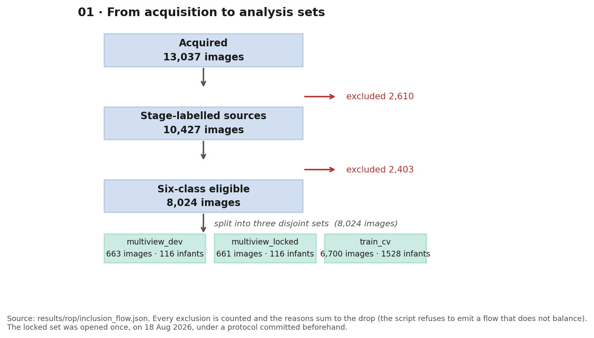
*Figure 1. Where every image went: from 13,037 acquired down to the final analysis sets. Every excluded image is counted with its reason, and the reasons are forced to add up.*

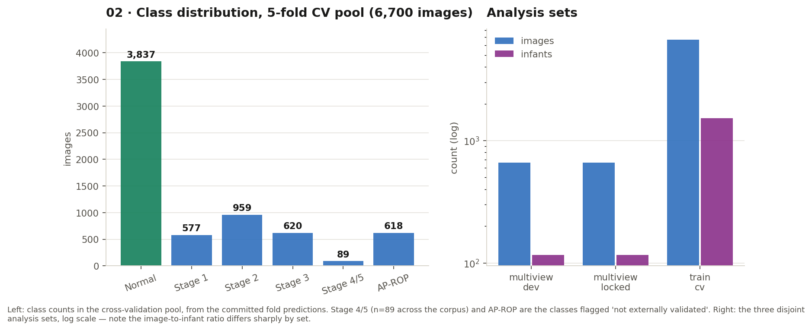
*Figure 2. What the corpus contains. Left: how many images each stage has — note how small stage 4/5 and AP-ROP are. Right: the three separate analysis sets.*

## 3. What was wrong with the data (and why it matters more than the model)

Three discoveries shaped the whole project. None of them are about neural networks.

### 3.1 — 43% of the "ROP" images are not ROP

The Ostrava labels mark 3,024 images as ROP-positive. Reading the clinical records image by image, **1,295 of them show other diseases**: retinal bleeding (1,061), toxoplasma infection (114), benign growths (72), and underdeveloped optic nerves (48). True ROP is 1,729 images — from only **20 infants**. A model trained on these labels is really an "abnormal retina detector", not an ROP detector. This finding still rests on our own non-expert reading, which is exactly why we are asking a paediatric eye specialist to re-grade ~300 images (§13).

### 3.2 — The shortcut: image size alone predicts disease

Different cameras were used for sick and healthy babies. The consequence: a "model" that looks only at the *width and height of the image file* — never at a single pixel — scores AUC 0.911 on the test split. Any neural network can find this shortcut too. Every result in this project has to be defended against it, which is why we always test on a hospital the model has never seen.

### 3.3 — One baby is 76% of a disease class

AP-ROP, the aggressive form, is rare. In our data, **one single Ostrava infant supplies 76% of all AP-ROP images**. Any statistic about AP-ROP is therefore mostly a statistic about that one baby unless we deliberately re-weight (§9).

## 4. The two models

Two neural networks matter in this story:

- **The screening head (now retired):** a ResNet50, trained to answer only "ROP or not ROP". Simple, and it looked excellent at home.
- **The structured staging model (now serving everything):** an EfficientNetV2-S backbone with a head shaped like the disease itself: an *ordinal* ladder for stages 1–3 (because stage 2 sits genuinely between 1 and 3, the model is punished more for bigger mistakes — the CORN method), a separate branch for AP-ROP (because it is a different form, not a rung on the ladder), and a *site adversary* branch that tries to stop the network from memorising which hospital an image came from.

Since the re-basing (§6), the structured model produces *all three* outputs the app shows: the screening verdict, the ICROP stage, and the heatmap — one network, one forward pass, so the explanation can never come from a different model than the decision.

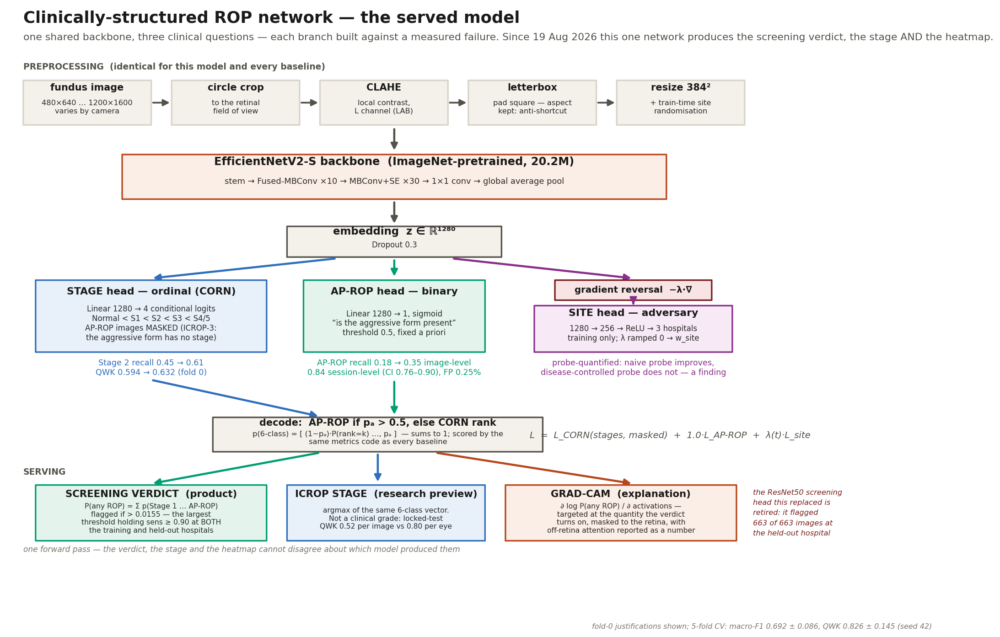
*Figure 3. The full system. One trained network (bottom) now produces all three things the app serves: the screening verdict, the ICROP stage, and the heatmap. The retired ResNet50 is marked as retired.*

## 5. Why the screening model had to be retired

At its home hospitals the ResNet50 screening head scored sensitivity 0.990 — it caught 99% of disease. Then we did the audit that should always come next: we scored it at the held-out hospital, with its decision threshold left exactly as deployed.

> **The failure, in one sentence.** At the second hospital, the *lowest* score it gave any image was 0.279 — above its decision line of 0.193 — so it flagged **all 663 images, including all 150 healthy eyes**. Specificity: 0.000. A fire alarm that is always ringing detects every fire, and is useless.

The threshold was not "wrong"; it was fitted to a score distribution that simply does not exist at the other hospital. Scores shift between sites. The deeper number: its ranking ability (AUC) fell from 0.970 at home to **0.691** away — approaching a coin toss at 0.5. The structured model, on the same 663 images, kept 0.821. That is the like-for-like comparison that decided the retirement.

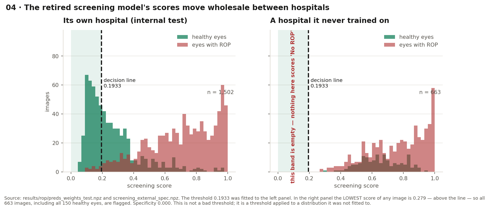
*Figure 4. The retirement evidence. Left: at home, the threshold (dashed line) separates the two score piles nicely. Right: at the held-out hospital the entire pile sits above the line — every image gets flagged, healthy or not.*

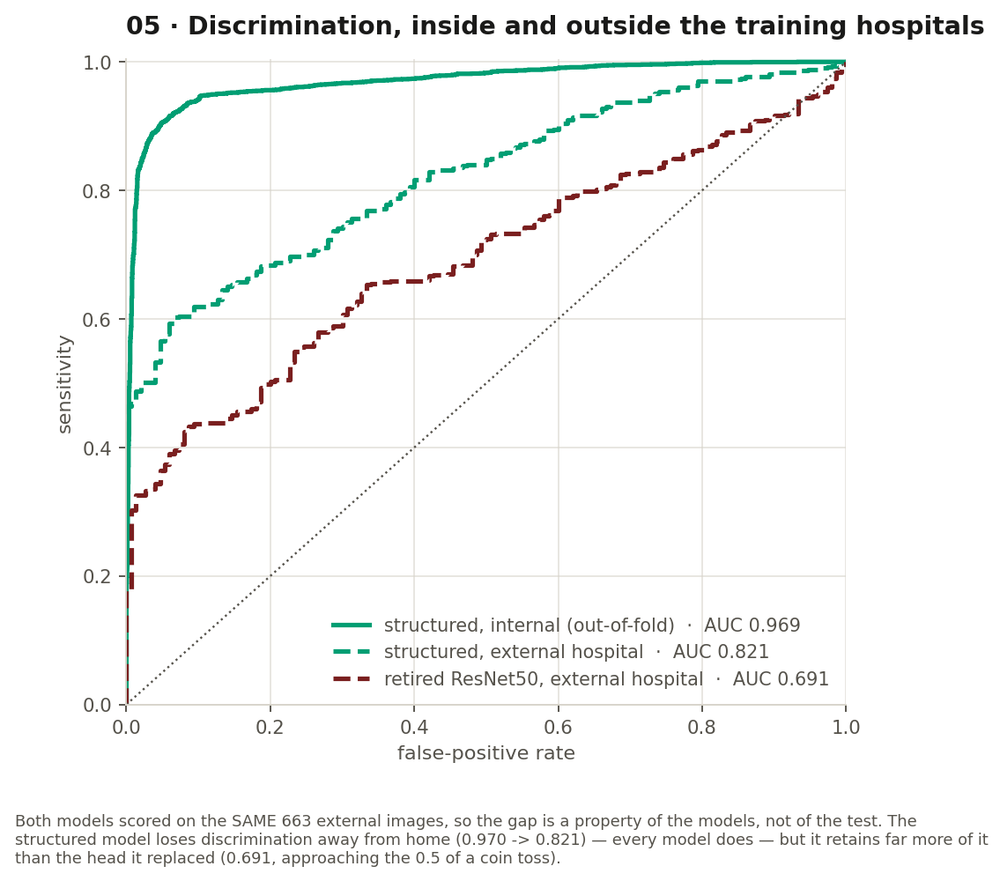
*Figure 5. Both models ranked the same 663 external images. The structured model keeps AUC 0.821 away from home; the retired one falls to 0.691, close to guessing.*

## 6. Re-basing: choosing the new decision line honestly

The product now uses the structured model's "probability of any ROP" as its screening score. But a score needs a **decision line** (threshold): above it, the app says "screened positive". Picking a threshold after staring at the results is a classic way to fool yourself, so we wrote the rule down first:

> *Take the largest threshold whose sensitivity stays at or above 0.90 at **both** the training hospitals and the held-out hospital.*

Largest, because specificity (not raising false alarms) is what we are trying to buy. Both sites, because satisfying only the home hospital is exactly the failure of §5. The rule selects **0.0155**, and gives:

| Where measured | Sensitivity | Specificity | What it means |
|---|---|---|---|
| Training hospitals (out-of-fold, n=6,700) | 0.958 | 0.781 | catches 96% of disease, clears 78% of healthy |
| Held-out hospital (dev half, n=663) | 0.905 | 0.387 | catches 90% of disease, clears 39% of healthy |
| Retired model, same 663 images | 1.000 | 0.000 | flags everything — no information |

Honesty note that travels with every use of these numbers: the dev half was *used to select* the threshold, so its own numbers are slightly optimistic ("in-sample"). A clean confirmation needs a third hospital that no half of this process has touched.

Two more things the figures below establish: at a real NICU's disease prevalence, most positives will still be false alarms — which is why the app words a positive as "have a clinician look", never as a diagnosis; and the score is *not* a calibrated probability (a score of 0.6 does not mean 60% chance of disease), which the app also says out loud.

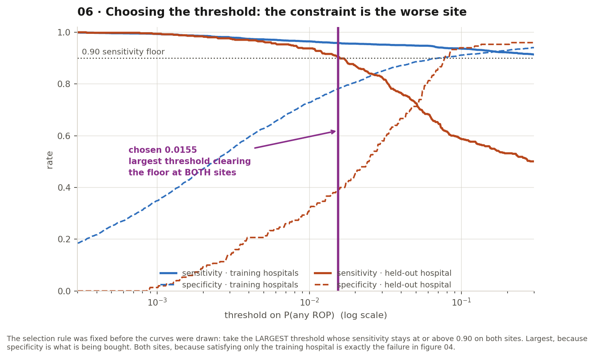
*Figure 6. How the new decision line was chosen: the rule (written before looking) picks the largest threshold that still catches ≥90% of disease at both sites.*

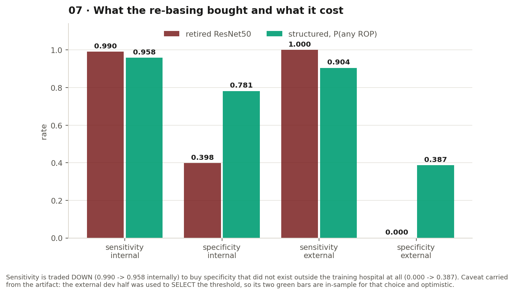
*Figure 7. What the re-basing bought and what it cost: a little sensitivity at home (0.990 → 0.958) traded for specificity abroad that previously did not exist at all (0.000 → 0.387).*

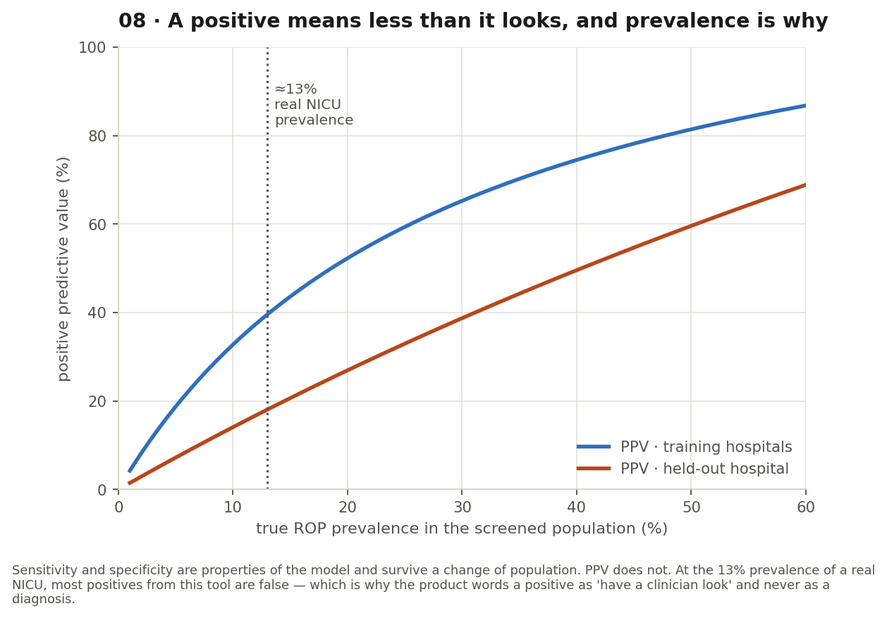
*Figure 8. Why a flag is not a diagnosis: at a real NICU's disease rate, most positives are false alarms even with a good model. The app's wording follows this figure.*

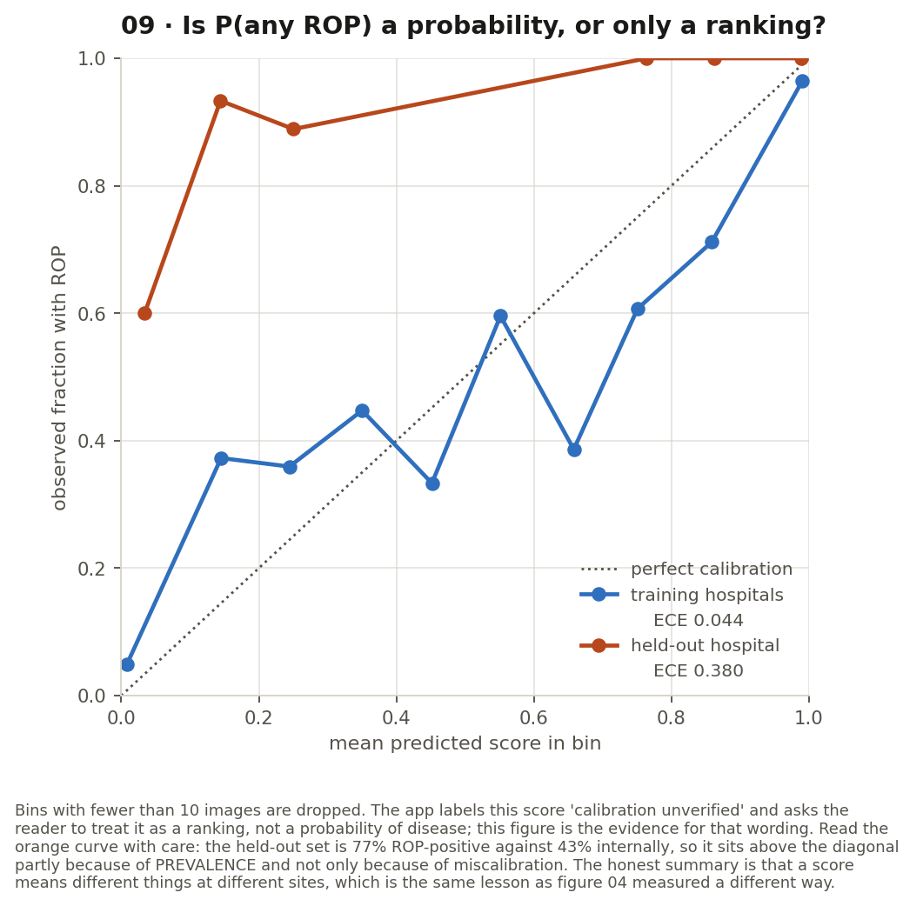
*Figure 9. The score is not a probability: the same score means different things at different hospitals. The app labels the score "calibration unverified" because of this figure.*

## 7. The finding of the project: how you count changes the answer

When we finally opened the locked half (661 images, 230 eyes, 116 infants), the headline was not about our architecture. It was about the **counting unit**.

Score the model per *photograph* and agreement with the doctors' labels (QWK) is **0.52**. Score the same predictions per *eye* — taking, for each eye, the most severe prediction across its photos, which is also how the labels were actually made — and agreement is **0.80**. Nothing about the model changed. Only the unit did.

Why so large? Because an ROP ridge grows in the retinal *periphery*, and a single photo often looks at the wrong part. Frames aimed at the periphery miss disease 12.7% of the time; frames aimed at the centre miss it 71.7% of the time. A photo of a diseased eye that does not contain the ridge is, as a picture, genuinely normal — and the confusion matrix shows exactly that: 73% of stage-1 frames are called Normal, while actual Normal frames are 99% correct. The errors are not random model failures; they point in an anatomical direction.

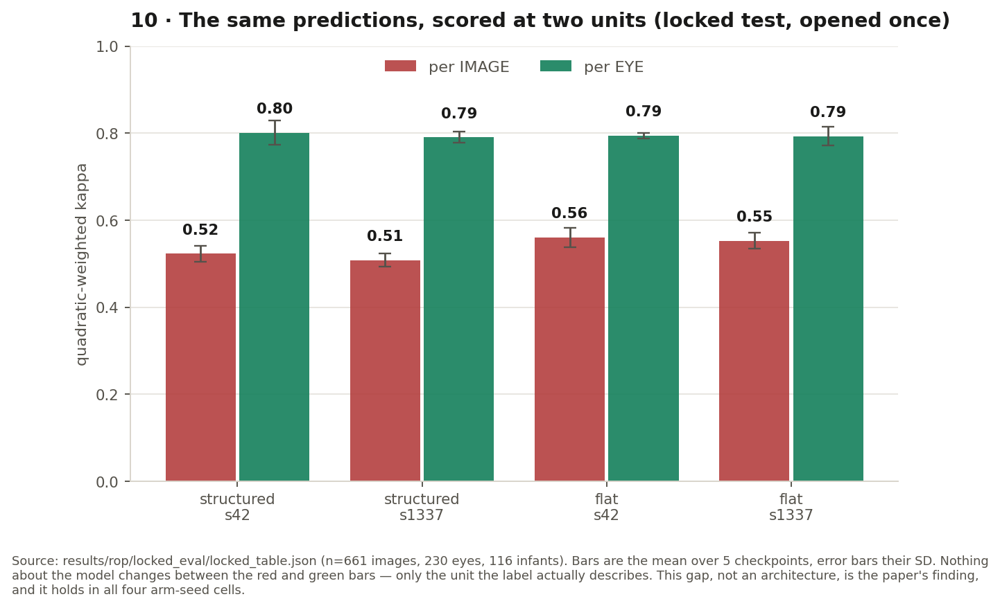
*Figure 10. The project's central finding: the identical predictions score QWK 0.52 counted per photo and 0.80 counted per eye. Only the counting unit changed.*

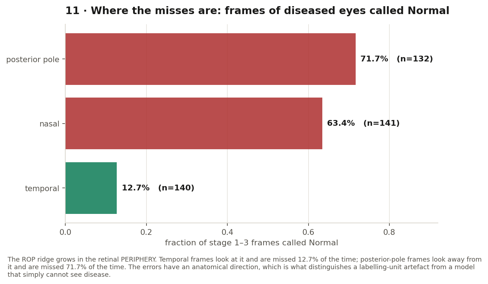
*Figure 11. Why: disease grows in the retinal periphery. Photos aimed at the centre miss it 71.7% of the time; photos aimed at the periphery only 12.7%. The misses have an anatomical direction.*

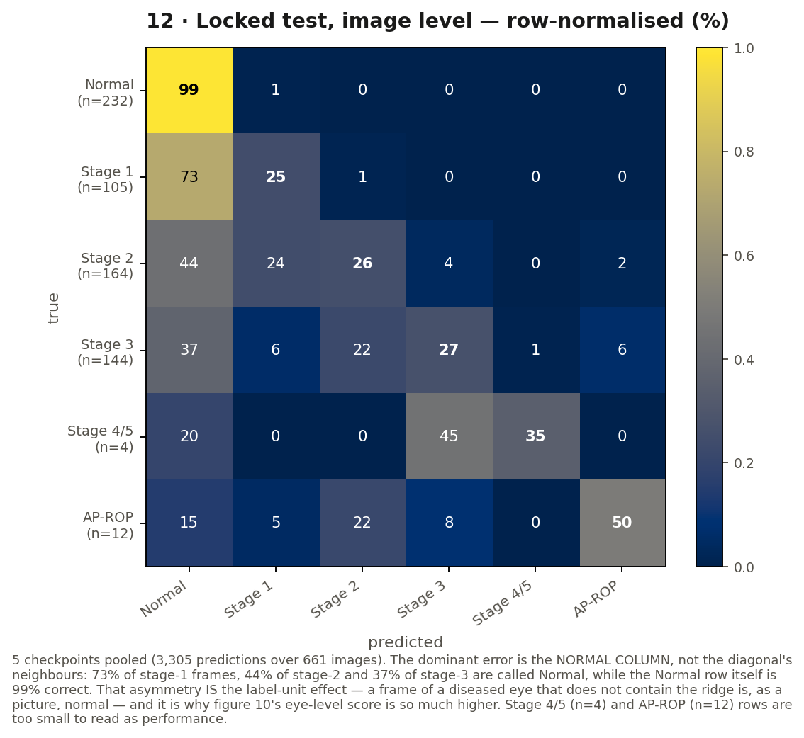
*Figure 12. The confusion matrix on the locked set. Errors do not scatter — they flow into the Normal column (73% of stage-1 photos are called Normal), exactly what photos that don't contain the ridge would produce.*

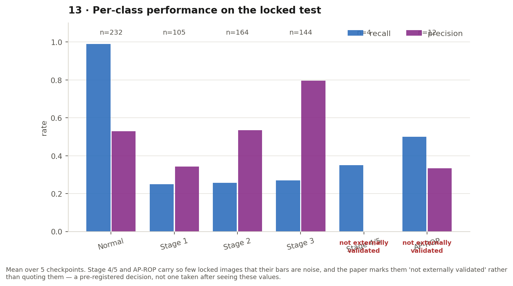
*Figure 13. Per-stage accuracy on the locked set. The stage 4/5 and AP-ROP bars rest on too few images to trust, and the paper marks them "not externally validated".*

## 8. Two negative results we report anyway

### 8.1 — The clever architecture is not better than the plain one

We compared the structured head against a plain flat 6-class classifier — identical data, folds, and preprocessing, only the head differs. At seed 42 the structured head is slightly worse (−0.0055); at seed 1337 it is slightly better (+0.0224). A difference that flips sign when you change only the random seed is noise. An earlier version of this project reported one seed and drew a confident conclusion; that was wrong, and the paper now claims measurement findings, not architecture superiority.

### 8.2 — The site adversary did not remove site information

The branch built to stop the network from memorising hospitals... did not. A probe can still read the hospital out of the features with 0.86–0.92 accuracy at every adversary strength. We report this as a negative result — and note the trap we avoided: the naive way of measuring it *understates* the leakage, because disease and site are correlated.

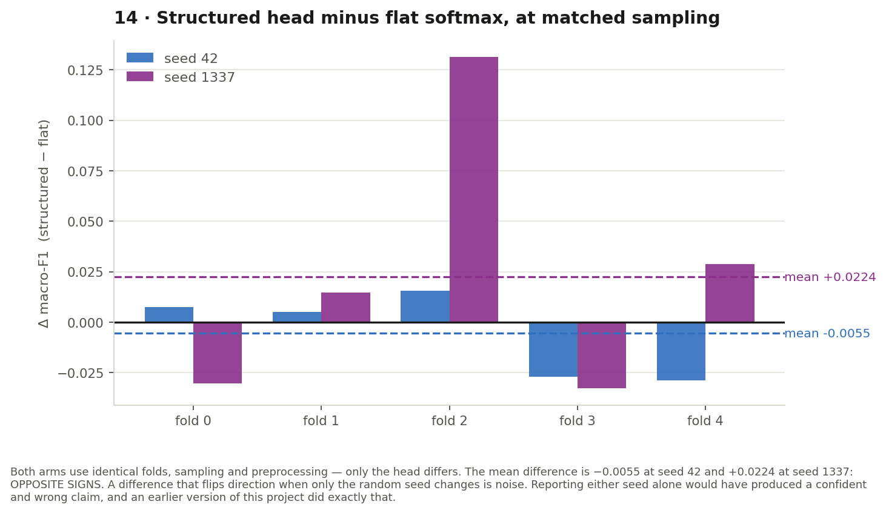
*Figure 14. Structured vs plain head: the difference flips sign between random seeds (−0.0055 vs +0.0224), which is the signature of noise. No architecture claim survives this figure.*

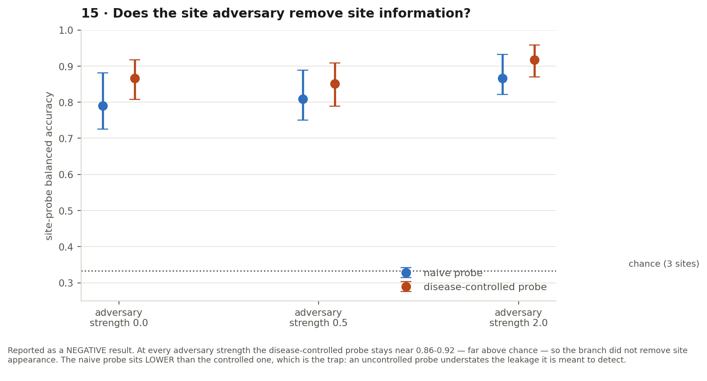
*Figure 15. A negative result, reported: at every adversary strength, hospital identity can still be read out of the features (0.86–0.92 accuracy). The de-biasing branch did not do its job.*

## 9. The AP-ROP "improvement" taken apart

A tempting headline: AP-ROP recall jumps from 0.21 per image to 0.86 per session (a session = one eye examination, several photos). But that jump mixes **two different causes**, and we separated them:

- **Re-weighting:** remember, one infant supplies 76% of AP-ROP images. Counting each session equally — instead of letting that baby dominate — moves the number before any grouping happens.
- **Aggregation:** taking the worst prediction across a session's photos moves it again.

Which one dominates? Our two analyses disagreed — so we pinned the more trustworthy one: the pooled 5-fold split, which covers every AP-ROP session exactly once, says **~70% of the jump is re-weighting** (population), not aggregation (unit). The single-fold analysis that says otherwise rests on 21 sessions and depends on which fold happened to receive the dominant infant; it appears in the figure as a demonstration of instability, not as an estimate.

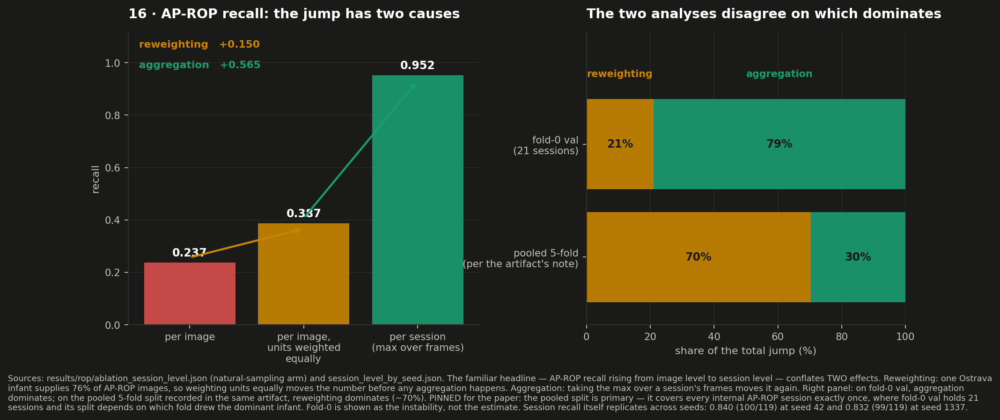
*Figure 16. The AP-ROP jump split into its two causes. Left: the three-step ladder from per-image to per-session. Right: the pooled analysis (primary) says ~70% of the jump is re-weighting — population, not unit.*

## 10. The heatmap investigation: our own error, caught, retracted, and re-measured

This section is the project's best evidence that our process works, because the mistake was ours.

### 10.1 — It started with a screenshot

A test upload produced a heatmap whose brightest blob sat in the black corner *outside* the eye. That is alarming for a project already burned once by shortcut learning (§3.2). We rebuilt the heatmap honestly: colour is only painted inside the retina, and the amount of attention falling outside is *measured and printed next to the image* instead of being cropped away quietly.

### 10.2 — The first cohort measurement, and why it was wrong

We then measured "attention outside the retina" over all 663 held-out images for both models, predicting the retired model would be worse. The result came back backwards: served model 40%, retired model 8%. Before believing it, we attacked it — and found the metric was broken in two ways:

- **Letterbox padding.** The structured model pads images to a square, so 25% of its frame is black bars *added by our own preprocessing*. 28 of those 40 points were landing on pixels that carry no information by construction. The retired model does not pad, so the two numbers never measured the same region.
- **The objective.** A heatmap is always a heatmap *of some quantity*. Keeping the weights and images identical and swapping only that quantity moved the number by 26 percentage points. A number that moves that much under a bookkeeping choice cannot rank two models measured under different choices.

Figure 17 is the retraction, in public, with the mechanism shown.

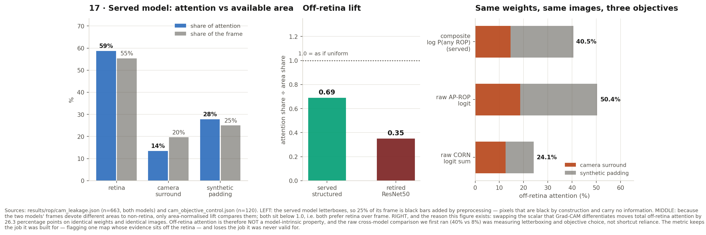
*Figure 17. The retraction. Left: a quarter of the served model's frame is padding our own preprocessing added. Right: changing only the quantity being differentiated moves "off-retina attention" by 26 points — so our first cross-model comparison measured bookkeeping, not models.*

### 10.3 — The matched rerun: what survives

The fix is a matched design: measure *both* models under the *same* objective form — twice, once per form — over all 663 images, and split "outside the retina" into the camera's own dark surround versus our synthetic padding. The finding that survives:

> **The reportable claim.** The served model's attention peak lands on the camera's own border in about **11–12% of images, versus 2–3%** for the retired model — roughly four times as often — and this holds under both matched objectives. The rest of the raw gap was letterbox geometry. Both models still weight the retina more than uniform; the served one does so more weakly, and the app prints the per-image number beside every heatmap so a human can judge each case.

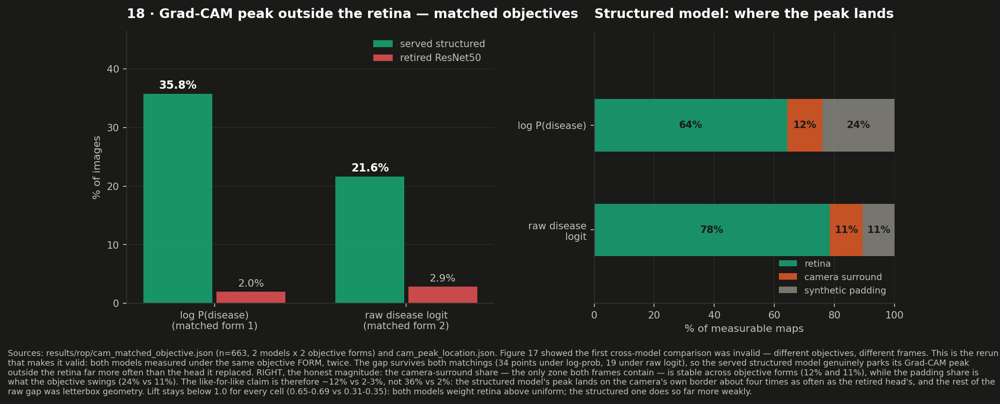
*Figure 18. The valid rerun. Left: the peak-outside-retina gap survives under both matched objectives — it is real. Right: but most of the served model's off-retina peaks sit on synthetic padding; the like-for-like number is ~11–12% vs 2–3% on the camera's own surround.*

## 11. What the app shows today

The web app was rebuilt around what users actually found confusing (a real test session produced "why is it showing ROP when there is no ROP?" — a fair question that the old interface could not answer). Now:

- **The verdict and the stage sit side by side** — no scrolling — and when they seem to disagree ("screened positive" but "stage: normal") a short note explains why: screening is deliberately over-cautious near the decision line.
- **A decision meter** shows the score, the decision line (1.55%), and which side the image fell on — so "56.3%" is never mistaken for "56.3% chance of disease".
- **The false-alarm reality is printed**: at the held-out hospital, 6 of every 10 healthy eyes are flagged. The tool says "have a clinician look", never "this baby has ROP".
- **Every heatmap carries its evidence numbers**: how much attention fell outside the retina, how concentrated it is, and where its peak sits (with padding separated from surround, per §10).
- **Three gates** reject non-fundus uploads before any of this runs.

## 12. Is the 0.90 floor protecting the right thing?

Our threshold rule guarantees 90% sensitivity for *any* ROP — but stage 1 usually heals by itself, while stages 3+ are the ones that need treatment. Were we spending our false alarms protecting the class that matters least? We measured it, per stage, at both sites:

| Sensitivity at the served threshold | Training hospitals | Held-out hospital |
|---|---|---|
| Stage 1 (usually self-healing) | 0.896 | 0.805 |
| Stage 2 | 0.965 | 0.978 |
| Stage 3 | 0.981 | 0.946 |
| Stage 4/5 (severe) | 1.000 | 1.000 |
| AP-ROP (aggressive) | 0.979 | 1.000 |

The answer is reassuring: **severe disease (stage 3 and up) is already caught 95–98% of the time** — the 0.90 floor only "binds" on stage 1. We also computed the alternative: putting the floor on severe disease instead would raise held-out specificity from 39% to 50%, but at the price of stage-3 sensitivity falling from 0.946 to 0.893 — trading treatment-relevant catches for fewer false alarms. Our recommendation is to keep the current threshold; the final call is a clinical one, and the data for it is committed (`results/rop/endpoint_severity.json`). Caveat: severe cases at the held-out site are few (14 stage-4/5, 6 AP-ROP), and no zone or plus-disease labels exist, so "stage 3+" is only a proxy for true treatment criteria.

## 13. What is still not proven, and what happens next

- **The labels need an expert.** The 43% finding (§3.1) rests on a student's reading. An outreach draft to a paediatric retina programme (KIDROP, Narayana Nethralaya) is ready, offering co-authorship for re-grading ~300 images.
- **The threshold needs a third hospital.** The dev half helped select it, so its numbers are optimistic. No unused external site exists yet in our data.
- **Stage 4/5 and AP-ROP are not externally validated.** Too few cases at the held-out site; the paper marks them so, by a decision taken before seeing the numbers.
- **The score is not a probability.** Calibration differs by site; the app says so.
- **The site adversary failed** at its job (§8.2) and is reported as a negative result.
- **Next:** compress this record into the 4-page ISBI 2027 format (deadline 26 October 2026), with the measurement findings — units, populations, labels — as the contribution.

---

# PART II — Every problem we faced, and what we did about it

Part I is the tidy version. This is the honest one: the full log of things that went wrong — in the data, in the models, in the app, in our own measurements, and in our own process — each with how it was found, what fixed it, and the proof. The pattern worth noticing: almost every serious problem was found by *auditing our own work*, and several of the project's best findings started life as our mistakes.

## A — Data and label problems

**A1 · Patient details were inside the filenames.**
*Problem:* every Ostrava image filename carries the infant's ID, sex, gestational age and birth weight — personal medical data that must never reach a public repository. *Solution:* patient images live only in git-ignored folders, and an automated test blocks any patient-pattern filename from ever being committed. *But:* we later found the `.gitignore` had a hole that made this guard decorative — fixed, and the test now proves the guard actually fires.

**A2 · Patient photos nearly left the machine anyway — through a door with no guard.**
*Problem:* while hand-assembling a code bundle for Kaggle (cloud training), the bundle silently swept up real infant retina photos saved earlier as error-analysis crops under `results/`. 51 MB, moments from upload. The git guard could not help — Kaggle is a different exit. *Solution:* a build script that assembles the bundle and then *sweeps* it, deleting the whole bundle rather than shipping anything with a patient filename, an image under results, or a credential. Run against the hand-made bundle it flagged **152 items**. *Lesson:* a guard protects a *path*, not a secret — every new exit route needs its own guard.

**A3 · The same baby existed twice, with opposite labels.**
*Problem:* a duplicate audit found 101 groups of byte-identical images (verified by pixel comparison, not just hashes — hashes collide easily on fundus photos). 19 groups cross split boundaries, and 19 have *contradictory labels*: the same photograph marked "no ROP" under one patient ID and "ROP" under another. Fourteen demographic signatures are shared by two patient IDs each — the same infants entered twice. *Impact, measured precisely:* the test set was clean (0 leaked images), but validation was ~2% contaminated — and validation chose the old threshold. *Solution:* threshold re-derived on cleaned data; the "no infant appears in two splits" claim qualified in writing.

**A4 · Joining images to clinical records silently dropped 821 images.**
*Problem:* the obvious join key (the baby's age) is stored fractionally in the records but truncated in filenames — the join silently loses 821 images. *Solution:* join on (infant ID, series, device) instead, which is exact.

**A5 · 43% of "ROP-positive" is not ROP.**
*Problem:* reading the clinical records image by image: of 3,024 positives, 1,295 show bleeding, infection, benign growths or optic-nerve underdevelopment — not ROP. True ROP: 1,729 images from 20 infants. *Solution so far:* the model is described honestly as an abnormal-retina detector; an expert re-grading of ~300 images is being arranged, because this finding must not rest on a student's reading.

**A6 · Two "different" public datasets share photographs.**
*Problem:* ROP-VL and the Shenzhen set come from the same hospital and share authors; re-encoded copies of the same photos defeat normal duplicate checks. *Solution:* a perceptual-hash comparison *calibrated against known duplicates* found 20–22 shared photographs (~1–2% of either set) — small, but now known and excluded from any cross-set claim.

**A7 · Every diseased image in the old test set came from one camera.**
*Problem:* all 824 ROP-positive test images were taken by device D1; all images from D2/D3 are healthy. A model can score well by recognising the camera. Controlling for device, AUC drops 0.927 → 0.881. *Worse:* our own first audit script concluded "the signal survives" — a generous verdict that missed the structural fact that only one device is measurable at all. *Solution:* the script's verdict logic was rewritten to report the structural finding first; a device-stratified re-split confirmed the confound was real and larger than expected; and the whole evaluation moved to a held-out hospital.

**A8 · One infant was a third of the old test set; another is 76% of AP-ROP.**
*Problem:* one baby contributed 470 of 1,502 test images (31%); weighting infants equally moves AUC from 0.927 to 0.899, and removing a single infant swings it by more than the gap between architectures. Separately, one infant supplies 76% of all AP-ROP images. *Solution:* all headline claims re-stated patient-weighted; the AP-ROP session analysis explicitly separates this population effect (§9).

## B — Model and evaluation problems

**B1 · The screening model failed completely at a second hospital.**
*Problem:* deployed threshold, held-out hospital: 663 of 663 images flagged, specificity 0.000, AUC 0.691. *Solution:* the model was retired and the product re-based onto the staging model, with the new threshold chosen by a rule written down *before* looking at the curves (§5–6).

**B2 · The architecture comparison was noise wearing a p-value.**
*Problem:* the standard significance test (DeLong) said one architecture beat the other. But it assumes independent images — and our images cluster inside infants. *Solution:* the correct cluster-aware test was run instead of caveated: significance vanished. Later, the 5-fold comparison flipped sign between random seeds (−0.0055 vs +0.0224). *Consequence:* the paper claims no architecture superiority anywhere — an earlier draft did, and was wrong.

**B3 · The de-biasing branch does not de-bias.**
*Problem:* the site-adversary branch was supposed to stop the network recognising hospitals. A probe still reads the hospital from the features at 0.86–0.92 accuracy, at every strength. *Solution:* reported as a negative result — and the measurement itself had a trap we document: the naive probe *understates* leakage because disease and site are correlated, so ours controls for disease.

**B4 · The quality gate was useless on its first calibration.**
*Problem:* the gradability gate (which rejects non-retina uploads) was first calibrated on data that made it pass everything. *Solution:* recalibrated on training splits only. A later self-review found its blur and exposure verdicts had *never been exercised* by any test; three tests were added, including one asserting mildly blurred images are still accepted — a gate that rejects everything is as useless as one that rejects nothing.

**B5 · Two analyses disagreed about the AP-ROP improvement.**
*Problem:* fold-0 says aggregation dominates the AP-ROP jump; the pooled 5-fold says re-weighting does. A paper cannot quote both as truth. *Solution:* pinned, with the reason in writing: the pooled split covers every AP-ROP session exactly once, while fold-0 rests on 21 sessions and changes with which fold received the dominant infant. Fold-0 is shown as instability, not evidence (figure 16).

## C — Web-app problems (each one found by a real user's screenshot)

**C1 · "It is not showing me the stage at all."**
*Problem:* the server computed the full staging result; the browser code silently dropped it. The user saw a verdict with no stage. *Solution:* the client now renders the staging panel, and verdict + stage sit side by side without scrolling.

**C2 · "Why is No-ROP so strong at 43.7%?"**
*Problem:* the app showed raw percentages with no decision line, so 56.3% vs 43.7% looked like a close call when the decision line is actually 1.55%. *Solution:* a decision meter that draws the line and shows which side the score fell on. A test caught that the line's label was rounded to one decimal (19.3 when the served value was 19.33) — fixed to two.

**C3 · "It says ROP detected, but ICROP stage is normal — what does that mean?"**
*Problem:* a genuinely confusing but correct state: screening is deliberately over-cautious, staging is not. *Solution:* a short reconciliation note appears exactly when the two disagree, explaining it in one sentence.

**C4 · "It doesn't have ROP, then also it is showing me" — a healthy eye flagged at 48.4%.**
*Problem:* at the held-out hospital the tool flags 6 of 10 healthy eyes; the interface hid that reality. *Solution:* the false-alarm rate is printed with the verdict, and a positive is worded as "have a clinician look", never as a diagnosis.

**C5 · "Give me in the simple words and short as well."**
*Problem:* our explanatory text was long and technical; the user could not use it. *Solution:* every panel's copy rewritten to about a third of its length, in plain words. This feedback also set the style of this very document.

**C6 · The heatmap's brightest blob was outside the eye.**
*Problem:* a user's upload produced heat in the black corner of the frame. *Solution:* colour is now confined to the retina and the off-retina amount is *measured and printed* instead of hidden. Three subtle bugs were found and fixed on the way: the "is the peak inside the retina" flag was accidentally always-true (it read the already-masked map — now reads the raw one, with a test that plants a peak in a corner); the padding mask was at first found by hunting dark rows, which wrongly eats the camera's own dark surround (now derived exactly from the preprocessing geometry); and in the PDF report the staging heading could collide with the heatmap caption (fixed with a layout guard and a test).

**C7 · A fresh download of the project would silently serve the retired model.**
*Problem:* the file carrying the new threshold was git-ignored; anyone cloning the repo would get an app that quietly fell back to the disqualified ResNet50 — no error anywhere. *Solution:* the file is committed, and a test now walks every runtime artifact and every figure input asking "would this survive a fresh clone?"

**C8 · A key figure could only be drawn from a file containing patient data.**
*Problem:* figure 4's source file contains 1,502 patient-pattern filenames and is rightly banned from the repo — making the figure unreproducible for anyone else. *Solution:* a de-identified companion file (scores and labels only, 5.7 KB) was derived and committed. The privacy rule was not loosened.

## D — The audits that audited us

**D1 · Our heatmap comparison was measuring our own preprocessing, not the models.**
*Problem:* we predicted the retired model reads the frame more; the measurement said the opposite (40% vs 8%) — because 25% of the served model's frame is padding we added ourselves, and because swapping the mathematical quantity being explained moves the number by 26 points. *Solution:* public retraction (figure 17), the live app corrected the same day it had shown the inflated number, and then a valid matched rerun (figure 18) that recovered what is actually true: peaks on the camera's own border ~11–12% vs 2–3%. *Lesson:* a falsified prediction is not a failure; believing the first number would have been.

**D2 · A figure caption said the opposite of its own picture.**
*Problem:* the confusion-matrix caption claimed errors cluster next to the diagonal; the rendered matrix plainly shows them flowing into the Normal column (73% of stage-1 called Normal). *Solution:* caption corrected against the image, and the reading — which is the more interesting truth — became part of §7.

**D3 · An earlier "critical finding" was our own test harness.**
*Problem:* an alarming result in a sister task (every healthy eye flagged) turned out to be a bug in our own evaluation harness, not in the model. *Solution:* corrected in the log with the cause; kept as a reminder that audit findings must themselves be audited before anyone acts on them.

## E — Process and safety incidents

**E1 · AI attribution had to be removed from the entire history.**
*Problem:* commit messages carried AI co-author trailers, which render as an AI avatar on graded coursework. *Solution:* all 142 commits rewritten to strip trailers, with every file's content verified byte-identical before and after, and the push conflict that rewriting causes resolved only after verifying the remote's tip matched our backup. No content changed — provable, not just claimed.

**E2 · Our own editing tools failed quietly, so we made them fail loudly.**
*Problem:* three small process traps cost real time: an automated refactor broke a file's indentation wholesale; a text replacement silently did nothing because its anchor didn't match; and git's ignore-checker "confirms" a file is ignored even when a negation rule un-ignores it. *Solution:* repaired the file; every scripted replacement now asserts it matched; ignore status is checked with a dry-run add, which answers the actual question.

**E3 · The locked test set stayed locked.**
*Problem to avoid, not one that happened:* the strongest temptation in a project like this is to "just check" the sealed data twice. *Solution:* the opening protocol was committed before opening; it was opened once, on 18 August 2026; every number from it is labelled; and it has not been touched since. The discipline is the result.

**E4 · Scope was cut, on evidence.**
*Problem:* the project once covered three diseases. Glaucoma's external number was contaminated by a dataset that mounts the same source twice, and could not be defended. *Solution:* glaucoma was dropped from scope after the finding was presented; the project is ROP-first with the DR work standing separately. Cutting a headline is cheaper than defending a wrong one.

---

# Appendix — Glossary: every term in simple words

| Term | Meaning |
|---|---|
| **ROP (retinopathy of prematurity)** | An eye disease of premature babies where retinal blood vessels grow abnormally. Treatable if caught early; can cause blindness if missed. |
| **Fundus image** | A photograph of the back of the eye (retina), taken through the pupil with a special camera. |
| **ICROP stages 1–5** | The international grading ladder for ROP: 1 = a thin demarcation line, 2 = a raised ridge, 3 = abnormal vessel growth, 4 = partial retinal detachment, 5 = total detachment. |
| **AP-ROP** | "Aggressive posterior ROP" — a fast, dangerous form that does not climb the normal stage ladder. Treated as its own category, not a stage. |
| **Plus disease / zone** | Extra clinical signs (dilated, twisted vessels; location of disease) that real treatment decisions use. Our dataset does not include them — a stated limitation. |
| **Screening vs staging** | Screening = "is there anything here? should a doctor look?" (yes/no). Staging = "how far has it progressed?" (which stage). |
| **Sensitivity** | Of all truly diseased eyes, the fraction the model flags. Sensitivity 0.90 = it catches 90% of disease and misses 10%. |
| **Specificity** | Of all healthy eyes, the fraction the model correctly leaves alone. Low specificity = many false alarms. |
| **Threshold / decision line** | The cut-off applied to the model's score: above it the app says "screened positive". Choosing it is a trade between sensitivity and specificity. |
| **AUC / ROC** | A single number (0.5 = coin toss, 1.0 = perfect) measuring how well the model's scores *rank* diseased above healthy, independent of any threshold. |
| **PPV and prevalence** | PPV: of all flagged eyes, the fraction truly diseased. It depends heavily on how common the disease is in the population (prevalence) — the same model has low PPV where disease is rare. |
| **Calibration** | Whether a score of 0.6 really means a 60% chance. Ours does not, and the app says so; the score is a ranking, not a probability. |
| **QWK (quadratic weighted kappa)** | Agreement between model and doctor on an ordered scale, where big disagreements (stage 1 vs 4) are punished more than small ones (stage 1 vs 2). 0 = chance, 1 = perfect. |
| **Evaluation unit / session** | What one "case" is when scoring: a photo, an eye, or one examination visit (session). §7 shows this choice alone moves QWK from 0.52 to 0.80. |
| **Cross-validation / fold / out-of-fold** | Training five copies of the model, each tested on a different fifth of the data, so every image gets a prediction from a model that never saw it. |
| **Held-out hospital** | A hospital whose images were never used for training or tuning — the closest thing to meeting the real world. |
| **In-sample** | A number measured on data that was also used to make a choice (like picking a threshold). Always somewhat optimistic; we flag every such number. |
| **Locked test set** | Data sealed away during development and opened once, under pre-written rules, so the final numbers cannot have been tuned toward. |
| **Grad-CAM / heatmap** | A method that colours the image regions that most influenced the model's answer. Useful for judging evidence; easy to fool yourself with, as §10 shows. |
| **Letterbox padding** | Black bars our preprocessing adds to make an image square — like a film on an old TV. Contains no information, and polluted our first attention measurement. |
| **Ordinal regression (CORN)** | A training method for ordered categories: it teaches the model that predicting stage 3 for a stage-1 eye is a bigger mistake than predicting stage 2. |
| **Site adversary** | A model component trained to *prevent* the network from recognising which hospital an image came from. Ours did not succeed, and we say so. |
| **Confusion matrix** | A table of predicted stage vs true stage. Ours shows errors flow toward "Normal" — the signature of photos that genuinely do not contain the disease's location. |
| **Cluster bootstrap / DeLong** | Statistical tests for comparing models. DeLong assumes every image is independent; when many images come from the same baby that breaks, and the cluster bootstrap (resampling whole infants) is the honest version. |
| **Perceptual hash (phash / dHash)** | A fingerprint of what an image *looks like*, used to find duplicates even after re-encoding. Collides easily on fundus photos, so every match must be verified pixel-by-pixel. |
| **Fail-closed** | A safety design where, if a check cannot run or fails, the system refuses to proceed — our Kaggle bundle builder deletes the bundle rather than uploading anything suspicious. |
| **Recall** | Same as sensitivity, used when talking about one specific class (e.g. "AP-ROP recall"). |

---

*Every figure above is generated by `scripts/make_paper_figures.py` from committed result files — no number is typed in by hand, so a figure cannot drift away from the artifact it claims to show.*
